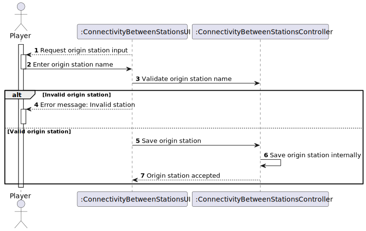
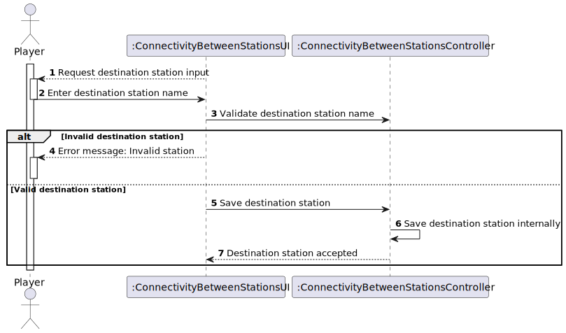
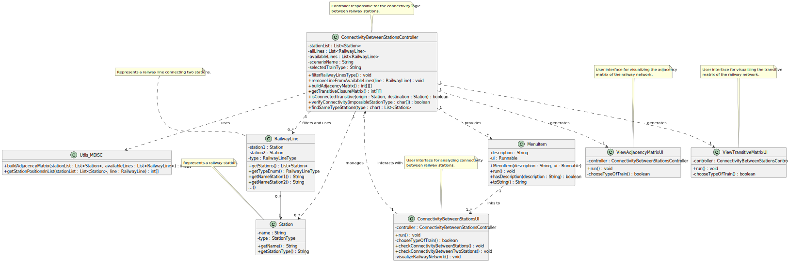

# US13 - Verify Train Travel Between Stations

## 3. Design

### 3.1. Rationale

**The rationale grounds on the SSD interactions and the identified input/output data.**

| Interaction ID | Question: Which class is responsible for...                | Answer                              | Justification (with patterns)                                                                                 |
|:-------------- |:----------------------------------------------------------|:------------------------------------|:-------------------------------------------------------------------------------------------------------------|
| **Step 1**     | ... interacting with the actor?                           | ConnectivityBetweenStationsUI        | Pure Fabrication: UI responsibility.                                                                         |
| **Step 2**     | ... coordinating the use case?                            | ConnectivityBetweenStationsController| Controller: coordinates the flow and logic.                                                                  |
| **Step 3**     | ... requesting the origin station name?                   | ConnectivityBetweenStationsUI        | Pure Fabrication: UI responsibility.                                                                         |
| **Step 4**     | ... validating the origin station name?                   | ConnectivityBetweenStationsController| Controller: validates input data.                                                                            |
| **Step 5**     | ... storing the origin station?                           | ConnectivityBetweenStationsController| Controller: temporarily stores user selection.                                                               |
| **Step 6**     | ... requesting the destination station name?              | ConnectivityBetweenStationsUI        | Pure Fabrication: UI responsibility.                                                                         |
| **Step 7**     | ... validating the destination station name?              | ConnectivityBetweenStationsController| Controller: validates input data.                                                                            |
| **Step 8**     | ... storing the destination station?                      | ConnectivityBetweenStationsController| Controller: temporarily stores user selection.                                                               |
| **Step 9**     | ... filtering railway lines by train type?                | ConnectivityBetweenStationsController| Controller: coordinates filtering of available lines.                                                        |
| **Step 10**    | ... building and displaying the matrices?                 | Utils_MDISC, ViewAdjacencyMatrixUI, ViewTransitiveMatrixUI | Utils: builds matrices; UI: displays matrices.                                              |
| **Step 11**    | ... verifying connectivity between stations?              | ConnectivityBetweenStationsController| Controller: contains the connectivity logic.                                                                 |
| **Step 12**    | ... informing the result to the user?                     | ConnectivityBetweenStationsUI        | Pure Fabrication: UI responsibility.                                                                         |

### Systematization ##

According to the taken rationale, the conceptual classes promoted to software classes are:

* Station
* RailwayLine
* Player

Other software classes (i.e. Pure Fabrication) identified:

* ConnectivityBetweenStationsUI
* ConnectivityBetweenStationsController
* ViewAdjacencyMatrixUI
* ViewTransitiveMatrixUI
* MenuItem
* Utils_MDISC

## 3.2. Sequence Diagram (SD)

**US13 Sequence Diagram - Full**

**US13 Sequence Diagram - Partial - Origin Station Selection**

**US13 Sequence Diagram - Partial - Destination Station Selection**

**US13 Sequence Diagram - Partial - Connectivity Verification**

## 3.3. Class Diagram (CD)

