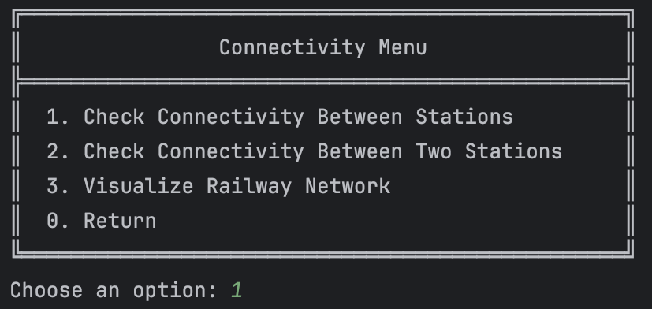
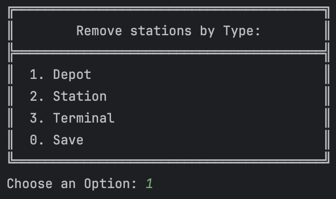
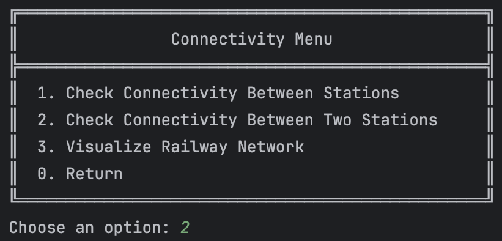
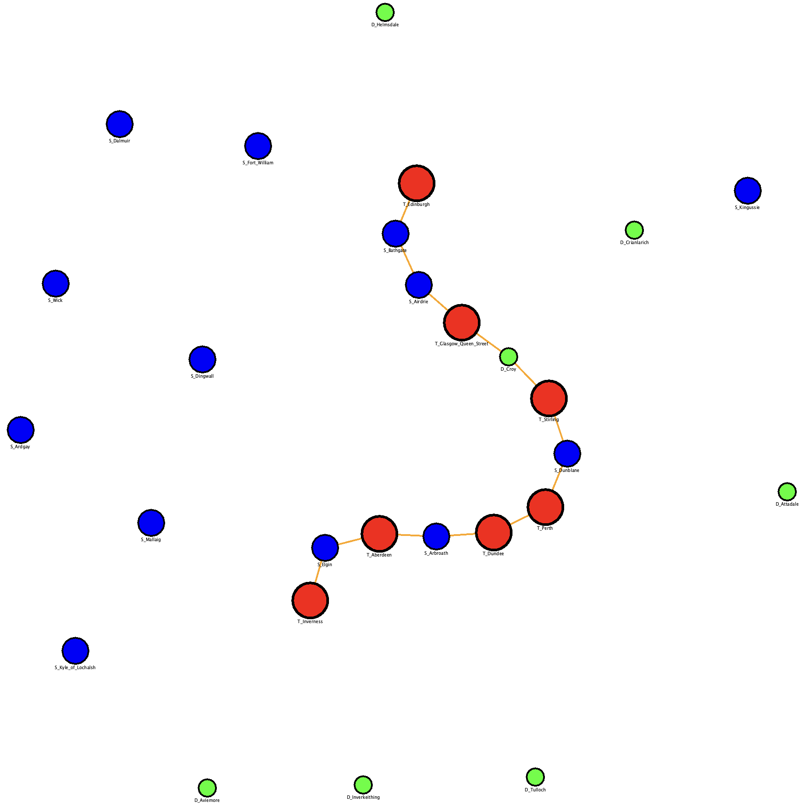
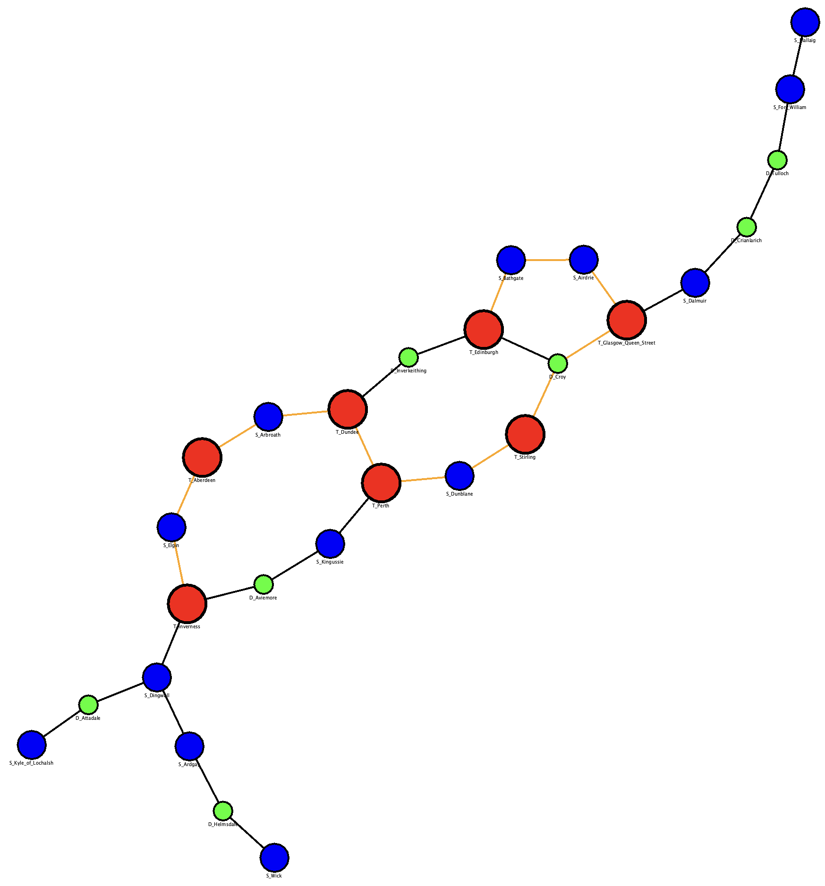
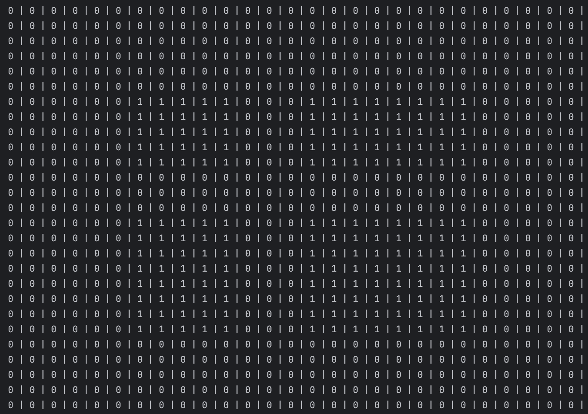

# Algorithm Documentation

---
**US13 - As a Player, given a railway with stations and lines connecting pairs of stations,
I want to verify if a specific train (steam, diesel, or electric powered) can travel
between two stations belonging to the rail network (or from any type of station to another of the same type).**

- AC01: The player should be able to choose the type of train (steam,
  diesel or electric) and station type (depot, station or terminal) in real
  time.
- AC02: A visualization of the stations, and the lines connecting stations
  of this scenario (using, for example, Graphviz or GraphStream packages) should be displayed to the player, where electrified railway lines
  are drawn with a different color from the others.
- AC03: All implemented procedures (except the used for graphic visualization) must use primitive operations only, and not existing functions
  in JAVA libraries.
- AC04: The algorithm(s) implemented to solve this problem should
  be documented/detailed in the repository documentation (using markdown format).
---

## Class Structure Overview

### ConnectivityBetweenStationsUI
> The ConnectivityBetweenStationsUI class represents the user interface (UI) for checking connectivity between railway stations and visualising the railway network.
> - Main functionalities:
>   - Train type selection: Allows the user to choose the type of train to be considered in the analysis (electric trains or all types).
>   - Connectivity check: Between all stations, excluding specific types (Depot, Station, Terminal) or between two specific stations.
>   - Railway network visualisation: Displays the railway network as a graph, with available stations and lines.

### ConnectivityBetweenStationController
>The `ConnectivityBetweenStationsController` class is responsible for managing the connectivity logic between railway stations, including filtering railway lines, constructing adjacency matrices and transitive closures, and checking connectivity.
> - Main functionalities:
>   - Filtering railway lines: Filters the available lines based on the type of train selected (electric or non-electric) and removes incompatible lines from the list of available lines.
>   - Matrix construction:  Generates the adjacency matrix representing direct connections between stations and then calculates the transitive closure matrix using the Warshall algorithm, representing all direct and indirect connections.
>   - Connectivity check: Checks that all valid stations are connected, excluding specific types of stations, and determines whether there is a path between two specific stations.
>   - Station search by type: Returns a list of stations of a specific type (Depot, Station or Terminal).
### ViewAdjacencyMatrixUI
>The `ViewAdjacencyMatrixUI` class represents the user interface (UI) for checking and visualising connectivity between railway stations in a specific scenario through an adjacency matrix.
>
> - Main functionalities:
>   - Train type selection: Allows the user to choose the type of train to be considered in the analysis (e.g. electric trains or all types of trains).
>   - Connectivity validation: Checks whether there is a connection between two specific stations or between all stations of the same type (Depot, Station or Terminal).
>   - Adjacency matrix visualisation: Generates and displays the adjacency matrix representing the direct connections between stations.
>   - Interaction with the controller: Uses the `ConnectivityBetweenStationsController` controller to perform operations such as filtering railway lines and building the adjacency matrix.

### ViewTransitiveMatrixUI
>The `ViewTransitiveMatrixUI` class represents the user interface (UI) for visualising the transitive closure matrix of a railway network in a specific scenario using the Warshall algorithm.
> - Main functionalities:
>   - Train type selection: Allows the user to choose the type of train to be considered in the analysis (e.g. electric trains or all types of trains).
>   - Connectivity validation: Checks that there are railway lines available and that there are at least two stations on the network.
>   - Visualisation of the transitive closure matrix: Generates and displays the transitive closure matrix, which represents all the direct and indirect connections between stations.

### Utils
>This class provides utility functions that support user interaction and railway network visualization, specifically for managing connectivity between railway stations.
>
> - Main features used in connectivity-related classes:
>   - Reads integer input from the user for selecting stations and menu options;
>   - Displays formatted menus and prompts using labeled options;
>   - Supports visualization of the railway network both in a live stream (GraphStream);
>   - Visualizes the railway network graphically using GraphStream, distinguishing between station types and line electrification.
---

## Explanation of the Implemented Algorithm

### Class ConnectivityBetweenStationsUI

>

>

>

>

>

>

>

>**Graph - Connections Between Electric Trains**
>

>**Graph - Connections Between All Train Types**
>

**Purpose:**        
The **imports** in this class serve to bring in functionalities from other parts of the project and from the Java library, which are necessary for the user interface to function properly.

    import pt.ipp.isep.dei.controller._MDISC_.ConnectivityBetweenStationsController;
    import pt.ipp.isep.dei.domain.RailwayLine.RailwayLine;
    import pt.ipp.isep.dei.domain.Station.Station;
    import pt.ipp.isep.dei.ui.console.menu.MenuItem;
    import pt.ipp.isep.dei.ui.console.utils.Utils;
    
    import java.util.ArrayList;
    import java.util.List;
---
**Purpose:**    
The constructor `ConnectivityBetweenStationsUI()` is responsible for instantiating the user interface component associated with station connectivity analysis. 
It receives as parameters a list of available stations, a list of railway lines, and a scenario name. 
These elements are passed to the underlying controller `ConnectivityBetweenStationsController()` which manages the core logic. 
By carrying out this initialisation, the constructor ensures that the user interface is prepared with the necessary data 
context to allow connectivity between railway stations to be analysed.

    public ConnectivityBetweenStationsUI(List<Station> stationList, List<RailwayLine> railwayLineList, String scenarioName) {
        this.controller = new ConnectivityBetweenStationsController(stationList, railwayLineList, scenarioName);
    }
---
**Purpose:**      
The `run()` method serves as an entry point to start analysing UI connectivity. It starts by checking whether the list of railway 
lines is empty or whether fewer than two stations have been provided. If either of these conditions is true, an error message 
is printed and the run ends. If the prerequisites are met, the method displays the main menu, where the user can choose between 
different options related to station connectivity and visualisation of the rail network. These options are cycled through until 
the user decides to exit. The method ensures that the user can interact with the programme and select different functionalities based on their needs.

>

    @Override
    public void run() {
        if (controller.getAllLines().isEmpty()) {
            Utils.printMessage("< List of lines is empty >");
            return;
        }
        if (controller.getSizeStationList() < 2) {
            Utils.printMessage("< There must be at least two stations >");
            return;
        }

        if (chooseTypeOfTrain()) {
            return;
        }

        do {
            List<MenuItem> options = new ArrayList<>();
            options.add(new MenuItem("Check Connectivity Between Two Stations", this::connectivityBetweenTwoStations));
            options.add(new MenuItem("Check Connectivity Between All Stations of the Same Type", this::connectivityBetweenAllSameTypeStations));
            options.add(new MenuItem("Visualize Railway Network", this::visualizeRailwayNetwork));

            int option = Utils.chooseOptionPrintMenuAndManualReturn(
                    "Connectivity Menu",
                    Utils.convertObjectsToDescriptions(options),
                    "Return",
                    "Choose an option"
            );
            if (option == 0) {
                return;
            }
            options.get(option - 1).run();
        } while (true);
    }
---
**Purpose:**        
The `chooseTypeOfTrain()` method asks the user to select the type of train to be analysed. It offers two options: Electrical Trains 
or All Train Types. The user's selection is transmitted to `ConnectivityBetweenStationsController(), which filters the railway lines 
according to the type of train chosen. If the user decides to return without making a selection, the method is terminated early. 
This method helps ensure that the connectivity analysis is adapted to the specific type of train the user is interested in, 
allowing for more accurate results.

>

    private boolean chooseTypeOfTrain() {
        List<String> options = new ArrayList<>();
        options.add("Electrical Trains");
        options.add("All Train Types");
    
        int option = Utils.chooseOptionPrintMenuAndManualReturn("Select Train Type", options, "Return", "Choice");
        if (option == 0) {
            return true;
        }

        controller.setTrainType(options.get(option - 1));
        controller.filterRailwayLinesType();
        return false;
    }
---
**Purpose:**            
The `checkConnectivityBetweenStations()` method allows the user to verify if all valid stations in the railway network are
connected, excluding specific station types chosen by the user. The user can exclude up to three station types (e.g., 
Depot, Station, Terminal) by interacting with the `chooseTypeOfStation()` method. If the user decides to return without 
selecting a type, the process is terminated early. The selected types are stored in a list, converted into a character 
array, and passed to the `controller.verifyConnectivity()` method, which checks the connectivity of the remaining stations. 
The result is displayed, indicating whether all valid stations are connected while excluding the specified types. This 
method provides flexibility for analyzing connectivity under different conditions.

>
   
    public void checkConnectivityBetweenStations() {
        List<Character> excludedTypes = new ArrayList<>();

        for (int i = 0; i < 3; i++) {
            char option = chooseTypeOfStation("Remove stations by Type:");
            if (option == 'N') { // Return
                break;
            }
            if (!excludedTypes.contains(option)) {
                excludedTypes.add(option);
            }
        }

        char[] excludedArray = new char[excludedTypes.size()];
        for (int i = 0; i < excludedTypes.size(); i++) {
            excludedArray[i] = excludedTypes.get(i);
        }

        boolean isConnected = controller.verifyConnectivity(excludedArray);
        System.out.printf("\nAll valid stations are connected (excluding types %s): %s\n",
                excludedTypes.toString(), isConnected ? "YES" : "NO");
    }
---
**Purpose:**        
The `checkConnectivityBetweenTwoStations()` method allows the user to verify whether there is a path between two specific 
stations in the railway network. Initially, the method retrieves the list of stations from the controller and displays 
them with their corresponding indices. The user is then prompted to select the origin and destination stations by entering 
their respective indices. The input is validated to ensure the indices are within the valid range; otherwise, the operation 
is cancelled. Once validated, the selected origin and destination stations are identified, and the method uses the controller's 
`isConnectedTransitive()` function to check if a path exists between them. Finally, the result is displayed, indicating whether a 
connection exists between the two selected stations. This method provides a straightforward way for users to analyse connectivity 
between specific stations in the network.

>

    public void checkConnectivityBetweenTwoStations() {
          List<Station> stations = controller.getStationList();

          // Show available stations
          System.out.println("\nStation list:");
          for (int i = 0; i < stations.size(); i++) {
              System.out.printf("%d - %s\n", i + 1, stations.get(i).getName());
          }

          // Ask for user input
          int originIndex = Utils.readIntegerFromConsole("\nChoose the ORIGIN station: ") - 1;
          int destinationIndex = Utils.readIntegerFromConsole("Choose the DESTINATION station: ") - 1;

          // Validate input
          if (originIndex < 0 || originIndex >= stations.size()
                  || destinationIndex < 0 || destinationIndex >= stations.size()) {
              System.out.println("Invalid station numbers. Operation canceled.");
              return;
          }

          Station origin = stations.get(originIndex);
          Station destination = stations.get(destinationIndex);

          // Check transitive connectivity
          boolean isConnected = controller.isConnectedTransitive(origin, destination);

          if (isConnected) {
              System.out.printf("\nIs there a path between '%s' and '%s'? YES\n", origin.getName(), destination.getName());
          } else {
              System.out.printf("\nIs there a path between '%s' and '%s'? NO\n", origin.getName(), destination.getName());
          }
    }
---
**Purpose:**        
The `chooseTypeOfStation()` method presents the user with a menu to select a station type (Depot, Station, or Terminal). 
It uses the `Utils.chooseOptionPrintMenuAndManualReturn()` method to display the options and capture the user's choice. 
Based on the selection, it returns a character corresponding to the chosen station type ('D', 'S', 'T'). If the user 
selects "Save" or provides an invalid input, it returns 'N'. This method is useful for filtering stations by type.   
 
    private char chooseTypeOfStation(String text) {
        List<String> options = List.of("Depot", "Station", "Terminal");
        int selected = Utils.chooseOptionPrintMenuAndManualReturn(text, options, "Save", "Choose an Option");

        switch (selected) {
            case 1:
                return 'D';
            case 2:
                return 'S';
            case 3:
                return 'T';
            default:
                return 'N';
        }
    }
---
**Purpose:**  
The visualizeRailwayNetwork() method uses the Utils.visualizeRailwayNetworkStream() function to graphically display the 
railway network. It passes as parameters the lists of stations of the same type (Depot, Station, Terminal) and the available 
railway lines, which are retrieved from the controller. This method is useful for providing an interactive visualization 
of the railway network, distinguishing between station types and lines.

    private void visualizeRailwayNetwork() {
        Utils.visualizeRailwayNetworkStream(controller.findSameTypeStations('D'), controller.findSameTypeStations('S'), controller.findSameTypeStations('T'),controller.getAvailableLines());
    }

---
### Class ConnectivityBetweenStationsController

**Purpose:**        
Imports give access to the classes needed to manage station connectivity. They include classes such as `Station` and `RailwayLine`, 
which represent the core elements of the railway network. Importing `java.util.*` enables the use of essential data structures and 
utilities such as `List`, `ArrayList`, `Queue`, `LinkedList`, `Arrays` and `Collections`, which are fundamental for storing station 
data, filtering railway lines and implementing graph-based algorithms.

    import pt.ipp.isep.dei.domain.RailwayLine.RailwayLine;
    import pt.ipp.isep.dei.domain.Station.Station;
    
    import java.util.*;
---
**Purpose:**    
The `ConnectivityBetweenStationsController` class is responsible for managing the logic related to connectivity between railway stations.

The class declares five private attributes:

- `List<Station> stationList`: contains the complete list of stations involved in the current scenario, representing the nodes of the railway network.

- `List<RailwayLine> allLines`: stores all the railway lines available in the system, regardless of train type or scenario filters.

- `List<RailwayLine> availableLines`: contains a subset of allLines filtered according to specific criteria, such as train type, and is used to build connectivity paths.

- `String scenarioName`: identifies the current scenario, allowing the controller to manage different configurations or data sets independently.

- `String selectedTrainType`: stores the type of train (e.g. electric or non-electric) selected by the user, which is used to filter the available railway lines accordingly.

    public class ConnectivityBetweenStationsController {
        private List<Station> stationList;
        private List<RailwayLine> allLines;
        private List<RailwayLine> availableLines;
        private String scenarioName;
        private String selectedTrainType;
---
**Purpose:**
The constructor `ConnectivityBetweenStationsController` initializes a new instance of the controller by receiving three 
parameters: a list of stations (`stationList`), a list of railway lines (`lines`), and a scenario name (`scenarioName`). 
These inputs define the initial context for the connectivity analysis.

Internally, the constructor assigns the provided `stationList` and `lines` directly to the corresponding class attributes. 
Additionally, it creates a new `list availableLines` as a copy of `lines`, ensuring that the original list of all lines 
remains unchanged when filtering operations are later applied to `availableLines`. Finally, it stores the `scenarioName`, 
allowing the controller to associate its operations with a specific scenario.

    public ConnectivityBetweenStationsController(List<Station> stationList, List<RailwayLine> lines, String scenarioName) {
        this.stationList = stationList;
        this.allLines = lines;
        this.availableLines = new ArrayList<>(lines);
        this.scenarioName = scenarioName;
    }
---
**Purpose:**    
This section of the class provides getter and setter methods for the main attributes of ConnectivityBetweenStationsController. 
These methods allow external components to retrieve or update the internal state of the controller while preserving 
encapsulation—a core principle of object-oriented programming.

- `getStationList()` and `setStationList()` allow reading and updating the list of stations that define the nodes of the railway network.

- `getAllLines()` and `setAllLines()` manage access to the complete list of railway lines in the system, regardless of filtering or scenario.

- `getAvailableLines()` and `setAvailableLines()` are used to retrieve or modify the list of lines that remain valid under current filter conditions (e.g. train type).

- `getScenarioName()` and `setScenarioName()` provide access to the name of the current scenario.

- `getSizeStationList()` is a utility method that returns the number of stations in the current list.

- `setTrainType()` assigns the selected train type (e.g. electric, non-electric), which can later be used to filter the list of available lines.

    public List<Station> getStationList() {
        return stationList;
    }

    public void setStationList(List<Station> stationList) {
        this.stationList = stationList;
    }

    public List<RailwayLine> getAllLines() {
        return allLines;
    }

    public void setAllLines(List<RailwayLine> allLines) {
        this.allLines = allLines;
    }

    public List<RailwayLine> getAvailableLines() {
        return availableLines;
    }

    public void setAvailableLines(List<RailwayLine> availableLines) {
        this.availableLines = availableLines;
    }

    public String getScenarioName() {
        return scenarioName;
    }

    public void setScenarioName(String scenarioName) {
        this.scenarioName = scenarioName;
    }

    public int getSizeStationList() {
        return stationList.size();
    }

    public void setTrainType(String selectedTrainType) {
        this.selectedTrainType = selectedTrainType;
    }
---
**Purpose:**    
The `filterRailwayLinesType()` method filters the list of available railway lines according to the selected train type. 
It begins by validating that a train type has been defined—if not, it throws an `IllegalArgumentException` to prevent 
undefined behavior. If the selected type includes the keyword "All", indicating that all train types are accepted, the 
method exits early without applying any filters.
Otherwise, the method creates a temporary copy of the `availableLines list` to avoid concurrent modification errors during 
iteration. It then checks each line’s type using its `getTypeEnum().getType()` method. The filtering condition ensures that 
only lines matching the selected type (e.g., electric vs. non-electric) are retained. Lines that do not match are removed 
by calling the helper method `removeLineFromAvailableLines(line)`.
    
    public void filterRailwayLinesType() {
        if (selectedTrainType == null) {
            throw new IllegalArgumentException("Train type cannot be null");
        }
        if (selectedTrainType.contains("All")) {
            return;
        }

        List<RailwayLine> currentAvailableLines = new ArrayList<>(availableLines);
        for (RailwayLine line : currentAvailableLines) {
            String type = line.getTypeEnum().getType();
            if ((!selectedTrainType.contains("Non") && type.contains("Non")) ||
                    (selectedTrainType.contains("Non") && !type.contains("Non"))) {
                removeLineFromAvailableLines(line);
            }
        }
    }
---
**Purpose:**    
The `removeLineFromAvailableLines(RailwayLine line)` method is a utility function designed to remove a specific railway 
line from the list of available lines. Before performing the removal, it checks whether the given line actually exists 
in the `availableLines` list. If not, the method throws an `IllegalArgumentException` to signal an invalid operation, 
preserving data integrity.
If the line is present, it is removed from the list. This method is particularly useful when filtering the network based 
on criteria such as train type, ensuring that only compatible lines remain active for path searching.

    public void removeLineFromAvailableLines(RailwayLine line) {
        if (!availableLines.contains(line)) {
            throw new IllegalArgumentException("Line is not available");
        }
        availableLines.remove(line);
    }
---
**Purpose:**    
The `getAdjacencyMatrix()` method returns a bidimensional array of integers representing the adjacency matrix of the 
rail network. Instead of building the matrix directly, it delegates the task to the `buildAdjacencyMatrix()` method, 
encapsulating the logic and exposing only the final result.
An adjacency matrix is a fundamental data structure used in graph theory to represent connections between nodes, in this 
case stations. Each cell in the matrix indicates whether there is a direct connection (rail line) between two stations. 

    public int[][] buildAdjacencyMatrix() {
        return Utils_MDISC.buildAdjacencyMatrix(stationList, availableLines);
    }
---
**Purpose:**
The `reconstructPath` method is responsible for reconstructing the shortest path between two stations in a railway network. 
It takes as input an array of `previousStations`, the index of the origin station (`originIndex`), and the index 
of the destination station (`destinationIndex`). Starting from the destination index, it iterates backward through the 
previousStations array, adding each station to the path list until it reaches the origin index. After the loop, the origin 
station is added to the list. Since the path is constructed in reverse order (from destination to origin), the `Collections.reverse` 
method is used to reorder the list correctly. Finally, the method returns the reconstructed path as a list of stations.

    private List<Station> reconstructPath(int[] previous, int originIndex, int destinationIndex) {
        List<Station> path = new ArrayList<>();
        for (int at = destinationIndex; at != originIndex; at = previous[at]) {
            path.add(stationList.get(at));
        }
        path.add(stationList.get(originIndex));
        Collections.reverse(path);
        return path;
    }
---
**Purpose:**  
The `findSameTypeStations` method is responsible for finding all stations of a specific type in a list of stations. It takes
a character (`type`) as a parameter, representing the type of station to filter. The method iterates through the `stationList` 
and checks if the first character of each station's name matches the provided type. If it matches, the station is added 
to a new list called `sameTypeStations`. Finally, the method returns the list containing all stations of the specified type.

    public List<Station> findSameTypeStations(char type) {
        List<Station> sameTypeStations = new ArrayList<>();
        for (Station station : stationList) {
            if (station.getName().charAt(0) == type) {
                sameTypeStations.add(station);
            }
        }
        return sameTypeStations;
    }
---
**Purpose:**    
The `verifyConnectivity` method checks if all valid stations are connected in the 
railway network. It uses the transitive closure matrix to determine connectivity between stations. First, it initializes 
variables such as `stationCount`, which stores the total number of stations, and `isImpossible`, a boolean array marking stations 
as impossible based on the provided types. The `fillImpossibleStations` method is then called to identify and mark stations 
of the specified impossible types. The method iterates through all pairs of valid stations and checks if they are connected 
in the transitive closure matrix. If any valid station pair is not connected, the method returns `false`. If all valid stations 
are connected, it returns `true`.

    public boolean verifyConnectivity(char[] impossibleStationType) {
        int stationCount = stationList.size();
        boolean[] isImpossible = new boolean[stationCount];
        int[][] transitiveClosureMatrix = getTransitiveClosureMatrix();
        fillImpossibleStations(impossibleStationType, stationList, isImpossible);

        for (int i = 0; i < stationCount; i++) {
            if (isImpossible[i]) continue;

            for (int j = 0; j < stationCount; j++) {
                if (isImpossible[j]) continue;

                if (transitiveClosureMatrix[i][j] == 0) {
                    return false; // Estações válidas i e j não estão conectadas
                }
            }
        }

        return true; // Todas as estações válidas estão conectadas
    }
---
**Purpose:**
The `fillImpossibleStations` method identifies and marks stations as impossible based on the provided types. It takes an 
array of characters (`impossibleStationType`) representing the types of impossible stations, a list of stations 
(`stationList`), and a boolean array (`isImpossible`) that will be updated to indicate which stations are impossible.  
The method iterates through the station list and checks if the type of each station (the first character of the station's name) 
matches any of the impossible types. If a match is found, the corresponding position in the `isImpossible` array is set to true.
This allows other parts of the program to know which stations should be ignored in future analyses.

    public void fillImpossibleStations(char[] impossibleStationType, List<Station> stationList, boolean[] isImpossible) {
        for (int i = 0; i < stationList.size(); i++) {
            char stationType = stationList.get(i).getName().charAt(0);
            for (char impossibleType : impossibleStationType) {
                if (stationType == impossibleType) {
                    isImpossible[i] = true;
                    break;
                }
            }
        }
    }

---
**Purpose:**
The `getTransitiveClosureMatrix` method calculates the transitive closure matrix of a railway network using the **Warshall 
algorithm**. It returns a two-dimensional integer matrix that represents all direct and indirect connections between stations. 
First, the method initializes the closure matrix (`closure`) based on the adjacency matrix, which contains the direct connections 
between stations. Then, it applies the Warshall algorithm, iterating over all combinations of stations to check if there 
is an indirect path between two stations through a third one. If such a path exists, the corresponding cell in the closure 
matrix is updated to 1. Finally, the transitive closure matrix is returned, allowing the identification of all possible 
connections in the network.

    public int[][] getTransitiveClosureMatrix() {
        int[][] closure = buildAdjacencyMatrix();
        int stationCount = closure.length;

        for (int k = 0; k < stationCount; k++) {
            for (int i = 0; i < stationCount; i++) {
                for (int j = 0; j < stationCount; j++) {
                    if (closure[i][k] == 1 && closure[k][j] == 1) {
                        closure[i][j] = 1;
                    }
                }
            }
        }

        return closure;
---
**Purpose:**    
The `isConnectedTransitive` method checks whether there is a path between two specific stations (origin and destination) 
in a railway network, considering both direct and indirect connections. It uses the transitive closure matrix generated 
by the `getTransitiveClosureMatrix` method.  The method starts by obtaining the transitive closure matrix (`closure`), which 
represents all possible connections between stations. Then, it retrieves the indices of the origin and destination stations 
from the station list (`stationList`). If either station is not found, an `IllegalArgumentException` is thrown.  Finally, the 
method checks the value in the transitive closure matrix at the position corresponding to the origin and destination stations. 
If the value is 1, it means there is a path between the stations, and the method returns true. Otherwise, it returns false.
   
     public boolean isConnectedTransitive(Station origin, Station destination) {
        int[][] closure = getTransitiveClosureMatrix();
        int originIndex = stationList.indexOf(origin);
        int destinationIndex = stationList.indexOf(destination);

        if (originIndex == -1 || destinationIndex == -1) {
            throw new IllegalArgumentException("Stations not found in the list");
        }

        return closure[originIndex][destinationIndex] == 1;
    }
---
### ViewAdjacencyMatrixUI
>

>

>

**Purpose:**  
The imports in this class provide access to all the components needed to build a user interface for managing railway 
station connectivity. Specifically, the `ConnectivityBetweenStationsController` is imported to handle the core logic 
behind filtering railway lines and checking connections between stations. Additionally, the Station and RailwayLine 
domain classes are essential as they define the fundamental attributes of the railway network. Additionally, the Utils 
class is included to support user interaction, providing methods for displaying menus, reading input, and displaying messages. 
Finally, the inclusion of ArrayList and List in java.util allows for the creation and manipulation of dynamic collections,
crucial for storing railway stations and lines, for example.

    import pt.ipp.isep.dei.controller._MDISC_.ConnectivityBetweenStationsController;
    import pt.ipp.isep.dei.domain.RailwayLine.RailwayLine;
    import pt.ipp.isep.dei.domain.Station.Station;
    import pt.ipp.isep.dei.ui.console.utils.Utils;
    
    import java.util.ArrayList;
    import java.util.List;
---
**Purpose:**  
The `ViewAdjacencyMatrixUI` class implements the `Runnable` interface, indicating that it contains a `run()` method designed 
to execute code in a separate thread. It has a controller, of type `ConnectivityBetweenStationsController`,
which is likely responsible for managing and providing data related to the connectivity between stations.

    public class ViewAdjacencyMatrixUI implements Runnable {
        private ConnectivityBetweenStationsController controller;
---
**Purpose:**    
The constructor of the `ViewAdjacencyMatrixUI` class initializes the controller by passing in the list of stations, railway 
lines, and the scenario name. This setup ensures that the controller has all the necessary data to compute connectivity 
and build the adjacency matrix. By establishing this connection, the UI class remains focused on 
interaction and visualization, while delegating all logic and data handling to the controller.

    public ViewAdjacencyMatrixUI(List<Station> stationList, List<RailwayLine> railwayLineList, String scenarioName) {
        controller = new ConnectivityBetweenStationsController(stationList, railwayLineList, scenarioName);
    }
---
**Purpose:**    
The `run()` method begins by checking if the list of railway lines is empty, using `controller.getAllLines()`. If it is 
empty, an error message is displayed, and the method terminates. Next, it checks if there are fewer than two stations 
using `controller.getSizeStationList()`. If so, another error message is shown, and the method exits.
If the prerequisites are satisfied, the method proceeds by `calling chooseTypeOfTrain()`, which likely handles user input 
for selecting the type of train, returning if the user opts to exit or make a selection.
Afterward, the method retrieves the adjacency matrix by `controller.getAdjacencyMatrix()` and iterates through it, printing 
each value in the matrix to represent the connectivity between stations. The matrix is displayed row by row, with each 
element separated by " | " to provide a clear, formatted output. **This process allows the user to visualize the relationships between stations in the network.**

    @Override
    public void run() {
        if (controller.getAllLines().isEmpty()) {
            Utils.printMessage("< List of lines is empty >");
            return;
        }
        if (controller.getSizeStationList() < 2) {
            Utils.printMessage("< There must be at least two stations >");
            return;
        }

        if (chooseTypeOfTrain()) {
            return;
        }

        int[][] matrix = controller.getAdjacencyMatrix();
        for (int loop = 0; loop < matrix.length; loop++) {
            for (int loop2 = 0; loop2 < matrix[0].length; loop2++) {
                System.out.print(matrix[loop][loop2] + " | ");
            }
            System.out.println();

        }

    }
---
**Purpose:**    
The `chooseTypeOfTrain()` method presents the user with a menu to select the type of train they wish to view. It first 
creates a list of train options, including "Electrical Trains" and "All Train Types." 
The method then calls `Utils.chooseOptionPrintMenuAndManualReturn()`, which displays the menu and returns the user's 
choice. If the user selects the "Return" option (indicated by option == 0), the method returns true, indicating the user 
wants to exit or go back. Otherwise, it sets the selected train type in the controller using `controller.setTrainType()` 
and filters the railway lines based on the chosen train type through `controller.filterRailwayLinesType()`. Finally, the 
method returns false, signaling that the user has made a valid selection and the program should proceed.

    private boolean chooseTypeOfTrain() {
        List<String> options = new ArrayList<>();
        options.add("Electrical Trains");
        options.add("All Train Types");
        int option = Utils.chooseOptionPrintMenuAndManualReturn("Types of Trains", options, "Return", "Choice");
        if (option == 0) {
            return true;
        }
        controller.setTrainType(options.get(option - 1));
        controller.filterRailwayLinesType();
        return false;
    }
---
### ViewTransitiveMatrixUI
>

>

>

**Purpose:**    
Imports provide access to the classes allowed for connectivity functionality between railway stations. 
The `ConnectivityBetweenStationsController` class manages the connectivity logic between stations, including filtering 
railway lines and constructing adjacency matrices and transitive closures. The `RailwayLine` class represents a railway 
line, containing information such as connected stations and line type. The `Station` class represents a railway station, 
with attributes such as name and type. The `Utils` class provides useful methods for user interaction, such as displaying 
a menu, reading input, and viewing the railway network. The `ArrayList` and `List` classes from the Java library are used 
for manipulating dynamic collections, such as lists of railway stations and lines.

    import pt.ipp.isep.dei.controller._MDISC_.ConnectivityBetweenStationsController;
    import pt.ipp.isep.dei.domain.RailwayLine.RailwayLine;
    import pt.ipp.isep.dei.domain.Station.Station;
    import pt.ipp.isep.dei.ui.console.utils.Utils;
    
    import java.util.ArrayList;
    import java.util.List;
---
**Purpose:**
The `ViewTransitiveMatrixUI` class implements the Runnable interface, indicating that it contains a `run()` method for 
execution in a separate thread. It has a private attribute controller of type `ConnectivityBetweenStationsController`, 
which manages the logic for analyzing the transitive closure of the railway network.

    public class ViewTransitiveMatrixUI implements Runnable{
        private ConnectivityBetweenStationsController controller;
---
**Purpose:**
The constructor `ViewTransitiveMatrixUI` initializes the class by creating an instance of the `ConnectivityBetweenStationsController`. 
It takes three parameters: a list of stations (`stationList`), a list of railway lines (`railwayLineList`), and the scenario name 
(`scenarioName`). These parameters are passed to the controller, which handles the logic for analyzing the connectivity and
transitive closure of the railway network.

    public ViewTransitiveMatrixUI(List<Station> stationList, List<RailwayLine> railwayLineList, String scenarioName) {
        controller = new ConnectivityBetweenStationsController(stationList, railwayLineList, scenarioName);
    } 
---
**Purpose:**
The main objective of the `ViewTransitiveMatrixUI` class is to provide a user interface for visualising the transitive 
matrix of a rail network, representing all the possible connections, direct and indirect, between the stations 
in a specific scenario. The class uses a controller, `ConnectivityBetweenStationsController`, which manages the connectivity 
logic and generates the transitive matrix based on the data provided, such as the list of stations, railway 
lines and the type of train selected. During the execution of the `run()` method, the class validates that there is enough 
data to carry out the analysis, checking that there are at least two stations and that the list of railway lines is not 
empty. If these conditions are met, the user can choose the type of train to be considered, such as electric trains or 
all types. After this selection, the transitive matrix is generated and displayed on the console, allowing the 
user to visualise all the possible connections between stations.

    @Override
    public void run() {
        if (controller.getAllLines().isEmpty()) {
             Utils.printMessage("< List of lines is empty >");
             return; 
        }
        if (controller.getSizeStationList() < 2) {
             Utils.printMessage("< There must be at least two stations >");
             return;
        }

        if (chooseTypeOfTrain()) {
            return;
        }

        int[][] matrix = controller.getTransitiveClosureMatrix();
        for (int loop = 0; loop < matrix.length; loop++) {
            for (int loop2 = 0; loop2 < matrix[0].length; loop2++) {
                System.out.print(matrix[loop][loop2] + " | ");
            }
            System.out.println();
        }
    }
---
**Purpose:**
The `chooseTypeOfTrain` method is responsible for allowing the user to select the type of train to be considered in the 
analysis of the railway network. It begins by creating a list of options, which includes "Electrical Trains" and "All 
Train Types." These options are presented to the user through the `Utils.chooseOptionPrintMenuAndManualReturn` method, 
which displays a menu and captures the user's choice. If the user selects the "Return" option, represented by the value 
0, the method returns true, indicating that the user wishes to exit or go back. Otherwise, the method retrieves the 
selected train type from the list of options based on the user's input, sets it in the controller using the `controller.setTrainType` 
method, and filters the railway lines accordingly by calling `controller.filterRailwayLinesType`. Finally, the method returns 
false to signal that the user has made a valid selection and the program should proceed. This method ensures that the analysis 
is tailored to the specific type of train chosen by the user, providing flexibility and accuracy in the results.

    private boolean chooseTypeOfTrain() {
        List<String> options = new ArrayList<>();
        options.add("Electrical Trains");
        options.add("All Train Types");
        int option = Utils.chooseOptionPrintMenuAndManualReturn("Types of Trains", options, "Return", "Choice");
        if (option == 0) {
            return true;
        }
        controller.setTrainType(options.get(option - 1));
        controller.filterRailwayLinesType();
        return false;
    }
---
### Utils

**Purpose:**    
The `visualizeRailwayNetworkStream()` method takes four lists as input: dStations (depot stations), sStations (station stations), 
tStations (terminal stations) and lines (railway lines). It uses the GraphStream library to create a graphical network 
representation of these elements.

1) **Setting up GraphStream UI:**

- The property `System.setProperty("org.graphstream.ui", "swing");` ensures that the visualization uses a Swing-based interface for displaying the graph.

- A new Graph object is created, which will hold the nodes (stations) and edges (railway lines).

2) **Styling the Graph:**

- A custom stylesheet is applied to the graph, defining the appearance of the nodes (stations) and edges (railway lines):

- Station Nodes: There are three types of stations with different colors and sizes:

  - Terminal Stations (stationT) are represented in red with a size of 40px.

  - Station Stations (stationS) are represented in blue with a size of 30px.

  - Depot Stations (stationD) are represented in green with a size of 20px.

- Railway Lines (Edges): The lines are either electrified (orange, 2px) or non-electrified (black, 2px).

3) **Adding Nodes (Stations):**

- For each station type (terminal, station, depot), a corresponding node is added to the graph. If the node doesn't already 
exist (checked by `graph.getNode(station.getName())`), it is created with its name displayed as a label and the appropriate 
style class (stationT, stationS, or stationD).

4) **Adding Edges (Railway Lines):**

- For each railway line, an edge is created between the two stations it connects. The edge is uniquely identified by combining the names of the two stations.

- If the edge doesn't already exist (checked using `graph.getEdge(id)` and the reverse edge), it is added to the graph.

- The type of the line (electrified or non-electrified) is used to assign the correct style to the edge.

5) **Displaying the Graph:**

Finally, the `graph.display() method is called to display the visualized railway network in a graphical window.

    public static void visualizeRailwayNetworkStream(List<Station> dStations, List<Station> sStations, List<Station> tStations, List<RailwayLine> lines) {
        System.setProperty("org.graphstream.ui", "swing");
        Graph graph = new SingleGraph("Railway Network");

        graph.setAttribute("ui.stylesheet",
                "node.stationT { " +
                        "fill-color: red; size: 40px; text-alignment: under;" +
                        "stroke-mode: plain; stroke-color: black; stroke-width: 3px;" +
                        "}" +
                        "node.stationS { " +
                        "fill-color: blue; size: 30px; text-alignment: under;" +
                        "stroke-mode: plain; stroke-color: black; stroke-width: 2px;" +
                        "}" +
                        "node.stationD { " +
                        "fill-color: green; size: 20px; text-alignment: under;" +
                        "stroke-mode: plain; stroke-color: black; stroke-width: 2px;" +
                        "}" +
                        "edge.electrified { fill-color: orange; size: 2px; }" +
                        "edge.nonElectrified { fill-color: black; size: 2px; }"
        );

        // Terminal - T (large, red)
        for (Station station : tStations) {
            Node node = graph.addNode(station.getName());
            node.setAttribute("ui.label", station.getName());
            node.setAttribute("ui.class", "stationT");
        }

        // Station - S (medium, blue)
        for (Station station : sStations) {
            if (graph.getNode(station.getName()) == null) {
                Node node = graph.addNode(station.getName());
                node.setAttribute("ui.label", station.getName());
                node.setAttribute("ui.class", "stationS");
            }
        }

        // Depot - D (small, green)
        for (Station station : dStations) {
            if (graph.getNode(station.getName()) == null) {
                Node node = graph.addNode(station.getName());
                node.setAttribute("ui.label", station.getName());
                node.setAttribute("ui.class", "stationD");
            }
        }

        // Edges (railway lines)
        for (RailwayLine line : lines) {
            String id = line.getNameStation1() + "-" + line.getNameStation2();
            if (graph.getEdge(id) == null && graph.getEdge(line.getNameStation2() + "-" + line.getNameStation1()) == null) {
                Edge edge = graph.addEdge(id, line.getNameStation1(), line.getNameStation2());
                if (line.getTypeEnum().getType().toLowerCase().contains("non")) {
                    edge.setAttribute("ui.class", "nonElectrified");
                } else {
                    edge.setAttribute("ui.class", "electrified");
                }
            }
        }

        graph.display();
    }
