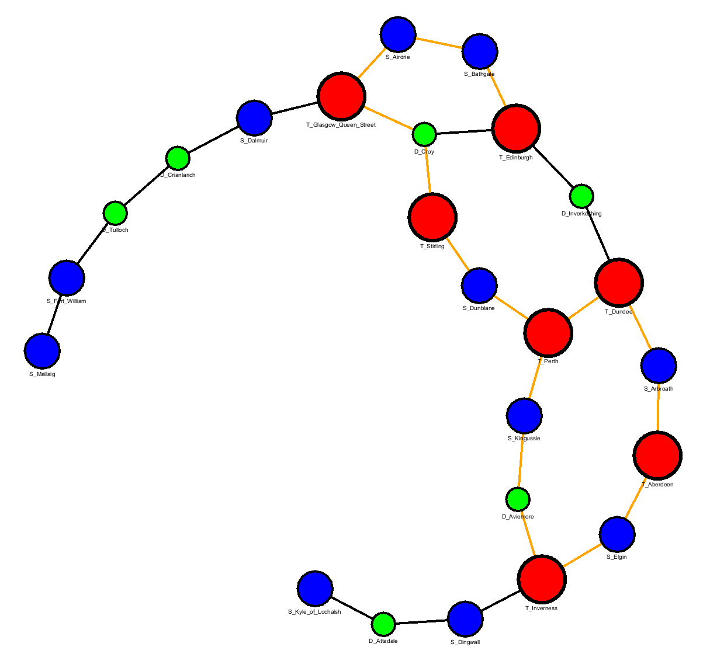
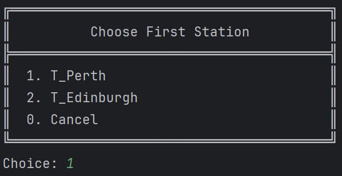
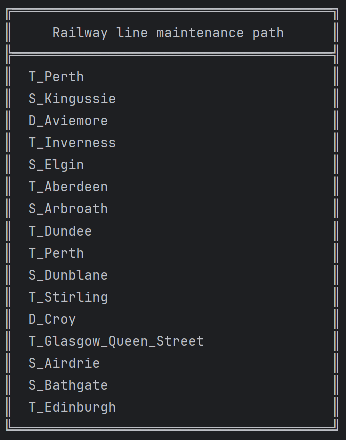
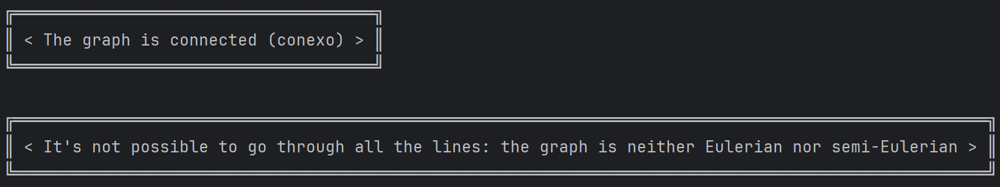

# Algorithm Documentation

---
**US14 - As a Player, given a railway with stations and railway lines, I
want to see a route that passes once, and only once, by each railway
line to carry out maintenance on the lines.**

- AC01: The player should be able to choose between the maintenance
  of all the lines, or only the electrified ones.

- AC02: A warning message should be displayed in case it is not possible
  to get such route. If possible, the station(s) where the route can start,
  should be displayed so that the player may select it.

- AC03: A visualization of the rail network (stations, railway lines)
  should be displayed to the player (using, for example, Graphviz or
  GraphStream packages), where electrified railway lines are drawn with
  a different color from the others. 

- AC04: All implemented procedures (except the used for graphic visualization)
  must only use primitive operations, and not existing functions
  in JAVA libraries.

- AC05: The algorithm(s) implemented to solve this problem should
  be documented/detailed in the repository documentation, using markdown
  format.
---

## Class Structure Overview
### MaintenanceRailwayLineUI
>This class represents the user interface for executing a maintenance routine on
a railway network. The aim is to find an Eulerian or semi-Eulerian path that visits
all the railway lines exactly once.
>
> - Main Features:
>
>   - Allows selection of railway line type (electrified, non-electrified, all),
>
>   - Verifies if the network is connected and whether it admits an Eulerian or semi-Eulerian path,
>
>   - Enables station selection to determine a valid starting point,
>
>   - Displays the final path (if found) and a graphical visualization of the network.

### MaintenaceRailwayLineController
>This class represents a controller, which is responsible for managing the maintenance of a railway network. 
The class provides logic for analysing graphs (based on stations and railway lines), including checking connectivity, determining Eulerian paths, and visualising paths.
>
>  - Main Features:
>     - Determine maintenance paths (Eulerian or Semi-Eulerian),
>
>     - Check graph connectivity,
>
>     - Filter lines by type,
>
>     - Build and visualise the railway network,
>
>    - Prepare data for line maintenance algorithms.

### Utils_MDISC
>This class is utilitarian and provides auxiliary methods for working with railway networks, specifically for constructing adjacency matrices based on a list of railway stations and lines.
> 
>  - Main Features:
>     - Help with the mathematical representation of a railway network in the form of an adjacency matrix.

## Explanation of the Implemented Algorithm
### Class MaintenanceRailwayLineUI

**Purpose:** 

The **imports** provide access to essential classes for the railway line maintenance interface, including control logic (`MaintenanceRailwayLineController`), domain entities such as `Station` and `RailwayLine`, and UI utilities (`Utils`). They also enable the use of data structures (`List`, `ArrayList`) and handling of input/output exceptions (`IOException`). This allows the class to interact with the user, process data, and display results appropriately.
    
    
    import pt.ipp.isep.dei.controller._MDISC_.MaintenanceRailwayLineController;
    import pt.ipp.isep.dei.domain.RailwayLine.RailwayLine;
    import pt.ipp.isep.dei.domain.Station.Station;
    import pt.ipp.isep.dei.ui.console.utils.Utils;

    import java.io.IOException;
    import java.util.ArrayList;
    import java.util.List;
---
**Purpose:**

The constructor initialises the `MaintenanceRailwayLineUI` class by creating a new instance of `MaintenanceRailwayLineController`, passing 
it the list of stations, the list of railway lines and the name of the scenario. This configuration ensures that the controller has all the data it needs to manage the logic and operations required to maintain the railway line.

    public MaintenanceRailwayLineUI(List<Station> stationList, List<RailwayLine> railwayLineList, String scenarioName) {
        controller = new MaintenanceRailwayLineController(stationList, railwayLineList, scenarioName);
    }
---
**Purpose:** 

The `run()` method is responsible for coordinating the process of generating and validating a railway maintenance path based on graph theory concepts, namely Eulerian graphs. 
The sequence of validations ensures that there are enough lines and stations, that the type of line has been chosen, that the graph is connected (necessary for an Eulerian path), and determines the type of graph (Eulerian or semi-Eulerian). 
After that, it selects the initial station and tries to build the maintenance path. If successful, it displays the result. Finally, the method calls `controller.visualisationOfRailwayNetwork()`, whose purpose is to visualise the resulting graph so that the user can graphically see the railway network and the route found. 
This method encapsulates all the logic needed to build, validate and visualise the solution, making it the central execution point of the functionality.

    @Override
    public void run() {
        if (controller.getAllLines().isEmpty()) {
            Utils.printMessage("< List of lines is empty >");
            return;
        }
        if (controller.getSizeStationList() < 2) {
            Utils.printMessage("< There must be at least two stations >");
            return;
        }
        if (chooseRailwayLineType()) {
            return;
        }
        if (controller.isNotGraphConnected()) {
            Utils.printMessage("< It isn't possible to form an Eulerian path: the graph isn´t connected (não é conexo) >");
            return;
        } else Utils.printMessage("< The graph is connected (conexo) >");
        controller.setValidStationsConnectedLines();
        if (controller.setEulerianPathType()) {
            Utils.printMessage("< It's not possible to go through all the lines: the graph is neither Eulerian nor semi-Eulerian >");
            return;
        }
        Utils.printMessage("< Is a " + controller.typeOfEulerianGraph() + " >");
        if (chooseInitialStation()) {
            return;
        }
        if (controller.setFinalPath()) {
            Utils.printMessage("< Eulerian path could not be formed: not all lines were visited >");
            return;
        }
        if (controller.getFinalMaintenancePath().isEmpty()) {
            Utils.printMessage("< No maintenance path found >");
        } else printFinalMaintenancePath();
        try {
            controller.visualisationOfRailwayNetwork();
        } catch (IOException e) {
            throw new RuntimeException(e);
        }
    }

---
**Purpose:**

The `chooseRailwayLineType()` method allows the user to select the type of railway lines they want to include in the maintenance operation - electrified, non-electrified or all types.
It presents these options in the form of a menu and gives the user the chance to cancel and go back. Once an option has been chosen, the method updates the controller with the selected type and applies a filter to restrict the railway lines to only those that match the user's preference. 
If the user chooses to cancel, the method ends without making any changes.

      private boolean chooseRailwayLineType() {
        List<String> options = new ArrayList<>();
        options.add("Electrified Railway Line");
        options.add("Non-Electrified Railway Line");
        options.add("All Railway Lines");
        int option = Utils.chooseOptionPrintMenuAndManualReturn("Type of Railway Lines", options, "Return", "Choice");
        if (option == 0) {
            return true;
        }
        controller.setRailwayLinesType(options.get(option - 1));
        controller.filterRailwayLinesType();
        return false;
    }

---
**Purpose:**

The `chooseInitialStation()` method is responsible for asking the user to select a valid initial station when an Eulerian or semi-Eulerian route is possible.
It obtains the list of valid initial stations from the controller and presents them to the user in a menu format, allowing cancellation if desired. When the user selects a station, it is added to the list of initial stations.

      private boolean chooseInitialStation() {
        while (true) {
            List<Station> validInitialStations = controller.getValidInitialStations();
            int option = Utils.chooseOptionPrintMenuAndManualReturn("Choose First Station", controller.convertStationsToNames(validInitialStations), "Cancel", "Choice");
            if (option == 0) {
                return true;
            }
            controller.addStationToStartingStations(validInitialStations.get(option - 1));
            chooseTheNextStations();
            return false;
        }
    }

---
**Purpose:**

The `chooseTheNextStations()` method is designed to guide the user step by step in selecting the next valid stations that are directly linked to the most recently chosen station, helping to form a continuous and valid maintenance path. 
It ensures that the list of initial stations selected grows to match the total number of valid stations, avoiding repetition by filtering out those already selected. If several linked options are available, the user is invited to choose; if there is only one option, it is automatically selected. 
This process ensures a logical and interconnected sequence of stations for the planned route.

    private void chooseTheNextStations() {
        while (controller.getSizeStartingStationsList() != controller.getSizeValidStationsList()) {
            List<Station> validStations = controller.removeStationsInList(controller.getStationsConnectedAnotherStation(controller.getLastStartingStation()),controller.getSelectedStartingStations());
            if (validStations.isEmpty()) {
                return;
            }
            if (validStations.size() != 1) {
                Utils.printMenu("Current path formed", Utils.convertObjectsToDescriptions(controller.convertStationsToNames(controller.getSelectedStartingStations())));
                int option = Utils.chooseOptionPrintMenuAndManualReturn("Next Station", controller.convertStationsToNames(validStations), "Save", "Choice");
                if (option == 0) {
                    return;
                }
                controller.addStationToStartingStations(validStations.get(option - 1));
            } else controller.addStationToStartingStations(validStations.getFirst());
        }
    }

---
**Purpose:**

The `printFinalMaintenancePath()` method is responsible for displaying the final sequence of stations that make up the calculated maintenance path. 
This sequence represents the Eulerian or semi-Eulerian path determined by the algorithm, ensuring that all railway lines are included according to the graph's connectivity rules. 
The method converts the list of station objects into station names and displays them in a user-friendly output menu using utility functions. This visual feedback makes it easier to understand and confirm the maintenance route proposed by the user.

      private void printFinalMaintenancePath() {
        List<String> maintenancePathNames = controller.convertStationsToNames(controller.getFinalMaintenancePath());
        Utils.printMenu("Railway line maintenance path",Utils.convertObjectsToDescriptions(maintenancePathNames));
    }

---
### Class MaintenaceRailwayLineController 

**Purpose:**

The `setEulerianPathType()` method analyses the structure of the graph representing the available railway network, determining whether it is possible to travel all
its lines without repetition, according to the rules of Eulerian paths. To do this, the method calculates the degree (number of connections) of each station (vertex) using the adjacency matrix. 
Based on these degrees, it checks whether the graph is Eulerian (when all the stations have even degree) or Semi-Eulerian (when exactly two stations have odd degree). 
This check is essential to know if there is a path that runs along all the lines once, starting and ending at the same point (Eulerian) or at different points (Semi-Eulerian). 
The method returns true when the graph does not fit into either of these two cases, i.e. it does not have a possible Eulerian path, which makes it impossible to run the maintenance algorithm based on this logic.

      public boolean setEulerianPathType() {
        findStationsWithOddDegree();
        semiEulerian = (oddDegreeStations.size() == 2);
        eulerian = oddDegreeStations.isEmpty();
        return !semiEulerian && !eulerian;
    }

---
**Purpose:**

The `typeOfEulerianGraph()` method indicates the type of graph resulting from the analysis of the railway network, based on the number of vertices (stations) with odd degree. 
After executing the `setEulerianPathType()` method, this method evaluates the results and returns a string that classifies the graph as ‘Eulerian graph’ (when all the stations have even degree), 
‘Semi-Eulerian graph’ (when exactly two stations have odd degree), or ‘Not Eulerian graph’ (when more than two stations have odd degree). This identification is useful for informing the user or other parts of the system 
about the possibility or impossibility of building a continuous maintenance path along the railway lines.

    public String typeOfEulerianGraph() {
        if (eulerian) {
            return "Eulerian graph";
        }
        if (semiEulerian) {
            return "Semi-Eulerian graph";
        }
        return "Not Eulerian graph";
    }

**Purpose:**

The `getValidInitialStations()` method determines and returns the valid stations for starting the maintenance route, based on the type of graph identified. 
In Semi-Eulerian graphs, where there are exactly two stations with odd degree, the method returns these two stations as possible starting points. In Eulerian graphs, 
where all the stations have even degree, all the stations that are connected to at least one line in the network are considered valid. This method ensures that the route starts at a point that respects the properties of the Eulerian graph.

      public List<Station> getValidInitialStations() {
        if (!semiEulerian && !eulerian) {
            throw new IllegalArgumentException("Eulerian path is not valid");
        }
        if (semiEulerian) {
            List<Station> initialStations = new ArrayList<>();
            for (String oddDegreeStation : oddDegreeStations) {
                initialStations.add(getStationByName(oddDegreeStation));
            }
            return initialStations;
        }
        return validStations;
      }

---
**Purpose:**

The `setFinalPath()` method builds the final railway maintenance path by combining the previously selected departure stations with the generated Eulerian route. 
This method ensures that the completed path reflects both the user's choices and the algorithm's logic, removing duplications and ensuring continuity between segments. 
The result is an ordered list of stations that represents the maintenance path to follow.

      public boolean setFinalPath() {
        List<Station> eulerianPath = findEulerianMaintenancePath();
        if (eulerianPath.isEmpty()) {
            return true;
        }
        finalMaintenancePath = new ArrayList<>();
        for (Station selectedStartingStation : selectedStartingStations) {
            finalMaintenancePath.add(selectedStartingStation);
        }
        if (!finalMaintenancePath.isEmpty()) {
            finalMaintenancePath.removeLast();
        }
        for (Station station : eulerianPath) {
            finalMaintenancePath.add(station);
        }
        return false;
      }

---
**Purpose:**

The `findEulerianMaintenancePath()` method generates a valid Eulerian path for railway maintenance. 
To do this, it first removes the links already used between the selected departure stations, avoiding repetition along the way.
It then invokes an adapted version of Hierholzer's algorithm to build the route. If the path found does not run along all the available lines, the method returns an empty list, indicating that it was not possible to build a complete Eulerian route.

      public List<Station> findEulerianMaintenancePath() {
        for (int i = 1; i < selectedStartingStations.size(); i++) {
            RailwayLine toRemove = getRailwayLineBetweenStations(selectedStartingStations.get(i).getName(), selectedStartingStations.get(i - 1).getName());
            removeLineFromAvailableLines(toRemove);
        }
        Station start = getLastStartingStation();
        List<Station> path = findEulerianPath(start, availableLines);
        if (path.size() < availableLines.size() + 1) {
            return new ArrayList<>();
        }
        return path;
      }

---
**Purpose:**

The `findEulerianPath(Station start, List<RailwayLine> allLines)` method implements the core of Hierholzer's algorithm, 
with the aim of finding an Eulerian path in a graph represented by stations and railway lines. 
It uses a stack to perform a depth-first traversal (DFS), removing links as they are visited to avoid repetition. 
As the vertices are unstacked, the path is reconstructed in reverse order. At the end, it returns the list of stations that make up the Eulerian path found.

    private List<Station> findEulerianPath(Station start, List<RailwayLine> allLines) {
        List<RailwayLine> copyLines = new ArrayList<>();
        for (RailwayLine allLine : allLines) {
            copyLines.add(allLine);
        }
        List<Station> path = new ArrayList<>();
        List<Station> stack = new ArrayList<>();
        stack.add(start);
        while (!stack.isEmpty()) {
            Station current = stack.getLast();
            RailwayLine line = findUnvisitedLine(current, copyLines);
            if (line != null) {
                Station next = getOppositeStation(current, line);
                stack.add(next);
                for (int i = 0; i < copyLines.size(); i++) {
                    RailwayLine l = copyLines.get(i);
                    if ((l.getNameStation1().equals(line.getNameStation1()) && l.getNameStation2().equals(line.getNameStation2())) ||
                            (l.getNameStation1().equals(line.getNameStation2()) && l.getNameStation2().equals(line.getNameStation1()))) {
                        copyLines.remove(i);
                        break;
                    }
                }
            } else {
                path.add(stack.removeLast());
            }
        }
        List<Station> reversedPath = new ArrayList<>();
        for (int i = path.size() - 1; i >= 0; i--) {
            reversedPath.add(path.get(i));
        }
        return reversedPath;
    }

---
**Purpose:**

The `isNotGraphConnected()` method performs a depth-first search (DFS) from the first station on the first railway line, travelling through all the accessible stations. 
If during the process it is identified that any station involved in the graph cannot be reached, the method returns true, indicating that the graph is not fully connected. 
Otherwise, the graph is considered connected and the method returns false.

      public boolean isNotGraphConnected() {
        if (availableLines == null || availableLines.isEmpty()) {
            return true;
        }

        List<String> visitedStations = new ArrayList<>();
        List<String> stationsToVisit = new ArrayList<>();

        // Começa com a primeira estação da primeira linha
        RailwayLine firstLine = availableLines.getFirst();
        String startStation = firstLine.getNameStation1();
        stationsToVisit.add(startStation);

        // DFS tradicional com listas
        while (!stationsToVisit.isEmpty()) {
            String current = stationsToVisit.getLast(); // pega o último
            stationsToVisit.removeLast(); // remove o último

            if (!visitedStations.contains(current)) {
                visitedStations.add(current);

                // Percorre todas as linhas e adiciona vizinhos conectados
                for (int i = 0; i < availableLines.size(); i++) {
                    RailwayLine line = availableLines.get(i);
                    if (line.getNameStation1().equals(current)) {
                        String neighbor = line.getNameStation2();
                        if (!visitedStations.contains(neighbor) && !stationsToVisit.contains(neighbor)) {
                            stationsToVisit.add(neighbor);
                        }
                    } else if (line.getNameStation2().equals(current)) {
                        String neighbor = line.getNameStation1();
                        if (!visitedStations.contains(neighbor) && !stationsToVisit.contains(neighbor)) {
                            stationsToVisit.add(neighbor);
                        }
                    }
                }
            }
        }
        // Verifica se todas as estações envolvidas nas linhas foram visitadas
        List<String> allStationsInGraph = new ArrayList<>();
        for (RailwayLine availableLine : availableLines) {
            String s1 = availableLine.getNameStation1();
            String s2 = availableLine.getNameStation2();
            if (!allStationsInGraph.contains(s1)) {
                allStationsInGraph.add(s1);
            }
            if (!allStationsInGraph.contains(s2)) {
                allStationsInGraph.add(s2);
            }
        }

        // Se todas as estações envolvidas foram visitadas, o grafo é conexo
        for (String s : allStationsInGraph) {
            if (!visitedStations.contains(s)) {
                return true;
            }
        }

        return false;
      }

---
**Purpose:**

The `filterRailwayLinesType()` method filters the list of available railway lines (`availableLines`) based on the type of line specified in `railwayLinesType`. 
If the type is ‘All’, all lines are kept. If the type is ‘Non’, the method only includes lines that are not maintained or, 
depending on the matching logic, it can exclude these lines, adjusting the list according to the type specified.

    public void filterRailwayLinesType() {
        if (railwayLinesType == null) {
            throw new IllegalArgumentException("Railway lines type cannot be null");
        }
        if (railwayLinesType.contains("All")) {
            return;
        }

        List<RailwayLine> linesCurrentlyAvailable = new ArrayList<>(availableLines);
        for (RailwayLine line : linesCurrentlyAvailable) {
            String type = line.getTypeEnum().getType();
            if ((!railwayLinesType.contains("Non") && type.contains("Non")) ||
                    (railwayLinesType.contains("Non") && !type.contains("Non"))) {
                removeLineFromAvailableLines(line);
            }
        }
    }

---
### Class Utils_MDISC

**Purpose:**

The `Utils_MDISC` class provides utility methods to support the analysis of railway networks. 
Its main purpose is to construct an adjacency matrix, which represents the connections between stations based on the available railway lines. 
This is useful for applying graph algorithms such as connectivity checking or Eulerian paths. The `buildAdjacencyMatrix` method builds this matrix, 
and the auxiliary method `getStationPositionsInList` identifies the positions of the stations in the master list to correctly index the matrix.

    package pt.ipp.isep.dei.ui.console.utils;

    import pt.ipp.isep.dei.domain.RailwayLine.RailwayLine;
    import pt.ipp.isep.dei.domain.Station.Station;

    import java.util.List;

    public class Utils_MDISC {

      // Builds the adjacency matrix representing connections between stations
      static public int[][] buildAdjacencyMatrix(List<Station> stationList, List<RailwayLine> availableLines) {
          int stationCount = stationList.size();
          int[][] adjacencyMatrix = new int[stationCount][stationCount];
          int[] positions;

         for (RailwayLine line : availableLines) {
              positions = getStationPositionsInList(stationList, line);
              adjacencyMatrix[positions[0]][positions[1]] = 1;
              adjacencyMatrix[positions[1]][positions[0]] = 1;
         }

         return adjacencyMatrix;
      }

      static public int[] getStationPositionsInList(List<Station> stationList, RailwayLine line) {
          int[] positions = new int[2];
          List<Station> lineStations = line.getStations();

          for (int i = 0; i < 2; i++) {
            String stationName = lineStations.get(i).getName();
             for (int j = 0; j < stationList.size(); j++) {
                  if (stationList.get(j).getName().equals(stationName)) {
                      positions[i] = j;
                      break;
                  }
              }
          }

          return positions;
      }
    }

   