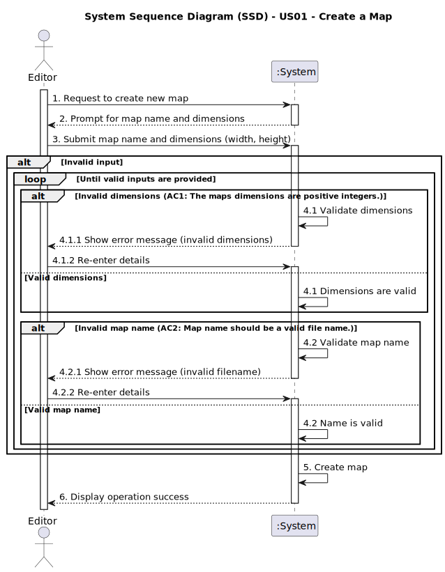

# US01 - Create a Map

## 1. Requirements Engineering

### 1.1. User Story Description

>As an Editor, I want to create a map with a size and a name.

### 1.2. Customer Specifications and Clarifications 

### Customer enquiries
>**Question:** Who will define the size of the map?
> 
>**Answer:** The Editor defines custom map dimensions during creation, which must be positive integers. 

>**Question:** Can the map size be a real number or does it have to be an integer?
> 
>**Answer:** The map is a set of cells, similar to a spreadsheet. The coordinates are integers (row and column, or alternatively X and Y)
> 
> [Customer Clarification - Fórum](https://moodle.isep.ipp.pt/mod/forum/discuss.php?d=34936)

>**Question:** When we're creating a name for the map, are there any limitations in terms of characters?
> 
> **Answer:** Yes, map names must follow standard filename restrictions:
>- Only alphanumeric characters and underscores are allowed
>- No spaces, special characters, or accented letters
>- Names must be unique within the system
>
> [Customer Clarification - Fórum](https://moodle.isep.ipp.pt/mod/forum/discuss.php?d=35067)

>**Question:** Can the names of scenarios and maps be the same?
> 
>**Answer:** Yes, they are different objects.
> 
> [Customer Clarification - Fórum](https://moodle.isep.ipp.pt/mod/forum/discuss.php?d=34908)

>**Question:** Will there be predefined maps, or will all maps be created by editors?
> 
>**Answer:** No.
> 
> [Customer Clarification - Fórum](https://moodle.isep.ipp.pt/mod/forum/discuss.php?d=34950)

### 1.3. Acceptance Criteria

>AC1: The maps dimensions are positive integers.

>AC2: Map name should be a valid file name. 

### 1.4. Found out Dependencies

>This User Story doesn't depend on any US.

### 1.5 Input and Output Data
>**Input**
> 
>The editor must input the map name (typed data - string) and map dimensions (typed data - positive integers).

>**Output**
>
>The system outputs a confirmation message upon successful map creation or an error message if the map name is invalid or if the dimensions are not positive integers.

### 1.6. System Sequence Diagram (SSD)

### 1.7 Other Relevant Remarks

>**(i) Special requirements:**
> 
>- The interface must validate the map name and dimension values in real time, alerting the user in the event of an error (e.g. invalid name or non-positive dimensions).
>- The map name must be unique in the system, composed only of alphanumeric characters and underscores, without spaces, accents or special characters.
>- The system can suggest predefined sizes to make creation easier, but the user is free to define any dimension (as long as they are positive integers).

>**(ii) How often this US is held:**
> 
> This user story (US01) is expected to be executed frequently, as map creation constitutes a recurring and essential task for Editors.
