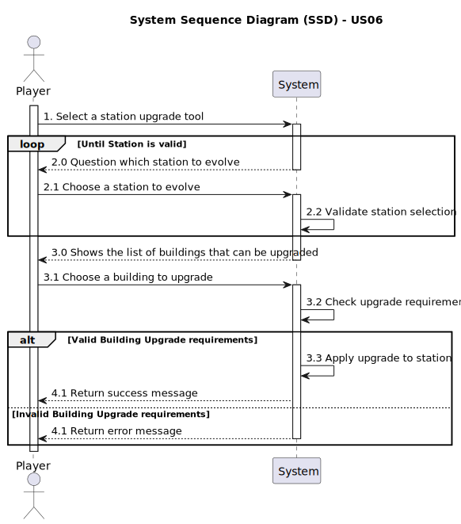

# US06 - Upgrade a station with a building

## 1. Requirements Engineering

### 1.1. User Story Description

>_As a Player, I want to upgrade a selected station with a building.
Each type of station improvement has a date from which it is available.
Some equipments are mutually exclusive (e.g., small and grand hotel)
and some equipments/buildings replace others (the telegraph was initially used to facilitate the operation of trains at stations, and was later
replaced by the telephone, so after the advent of telephone, telegraph
is no more available)._

### 1.2. Customer Specifications and Clarifications

>**Question:**
>Is there a limit on the number of buildings a station can be upgraded with?
> 
> **Answer:**
>No
> 
> [Customer Clarification - Fórum](https://moodle.isep.ipp.pt/mod/forum/discuss.php?d=35270)

>**Question:**
>Does the upgrade from telegraph to telephone occur automatically once a certain year is reached?
>
> **Answer:**
>There are no automatic updates; When a new building is available, the playerExample can buy it and then the previous building is replaced.
>
> [Customer Clarification - Fórum](https://moodle.isep.ipp.pt/mod/forum/discuss.php?d=35270)

>**Question:**
>In the statement, the example of a small hotel and a large hotel is given as mutually exclusive equipment. Does this mean that all upgrades of the same type are always mutually exclusive? Or, for example, is it possible to have more than one liquid storage unit at the same station?
Also, I'd like to confirm whether it's possible to have multiple buildings of different types at the same station. For example, can you have a small café, a large hotel and a post office at the same time?
If this is allowed, is there a maximum limit to the number of buildings in each station?
If there is, does it vary according to the type of station (Depot, Station or Terminal)?
Are all combinations of buildings allowed? For example, is the playerExample free to choose to have the following upgrades in the same station: customs + silo + telegraph?
> 
> **Answer:**
>There are mutually exclusive buildings such as small restaurants and large restaurants.
There are buildings that can no longer be built when they come into existence, for example, the telegraph has been replaced by the telephone. Stations that have a telegraph continue to operate with the telegraph until a telephone is built to replace the telegraph. Once there is a telephone, it is no longer possible to build a telegraph.
There can't be multiple identical buildings (for example, I can't have 3 grain silos)
All combinations are possible, as long as they respect the above restrictions.
>
> [Customer Clarification - Fórum](https://moodle.isep.ipp.pt/mod/forum/discuss.php?d=35110)

### 1.3. Acceptance Criteria

> AC01 - There can't be multiple identical buildings (e.g. I can't have 3 grain silos).

> AC02 - It's not an old version of an existing one (e.g. don't allow telegraph after telephone).

### 1.4. Found out Dependencies

>This User Story depends on US05:

>US05 - Build a Station.
>- Dependency: US06 depends on US05 to ensure that there is already a station where the playerExample could build a Building.

### 1.5 Input and Output Data

>For US06, the playerExample choose the Station he wants to upgrade and choose the Building that he wants to upgrade.

>The system outputs the list of stations that can be evolved, the list of buildings available to upgrade and, in case of success returns success message, otherwise returns error message.

### 1.6. System Sequence Diagram (SSD)

### 1.7 Other Relevant Remarks

> (i) Special requirements;
> 
> Mutual exclusivity between buildings of the same type
> 
> Compulsory replacement of obsolete buildings
> 
> Time constraints: each type of improvement can only be built from a certain date.

> (ii) Data and/or technology variations;  
> 
> Available buildings vary over time depending on the technologies that exist at the time.

> (iii) How often this US is held;
> 
> This feature can be used frequently throughout the game, especially after building stations
> 
> This use tends to be exponential, since as the game evolves, this feature becomes more and more useful.