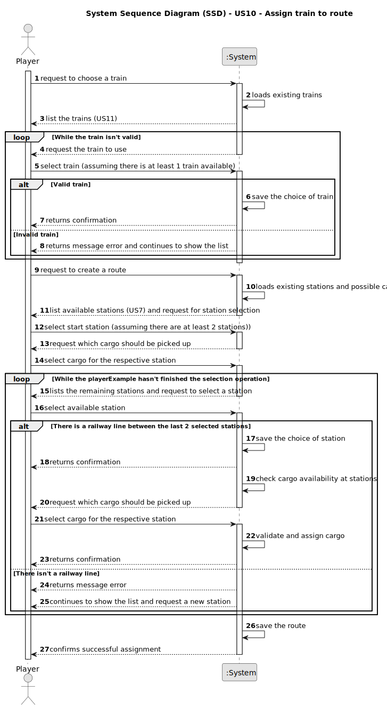

# US10 - Assign train to route

## 1. Requirements Engineering

### 1.1. User Story Description

> As a Player, I want to assign a selected train to a route with valid stations and the respective list of cargoes to be picked up in each station.

### 1.2. Customer Specifications and Clarifications 

>**Question:** A route is a list of stations where the train passes. If there is many stations but no railway lines, are we able to create a route?
>
>**Answer:** If there is no path between any pair of consective points of the route, the playerExample should be warned, then the playerExample can opt between cancel/proceed.
> 
> [Customer Clarification - Fórum](https://moodle.isep.ipp.pt/mod/forum/discuss.php?d=34864)

>**Question:** Can multiple cargo types be assigned to the same train? Does a route have a limit of stations that can be assigned?
> 
>**Answer:** Yes, No.                          
>
> [Customer Clarification - Fórum](https://moodle.isep.ipp.pt/mod/forum/discuss.php?d=35151)

### 1.3. Acceptance Criteria

>**AC1:** Route Validation
>- If a route includes stations without railway connections, the playerExample receives a warning;
>- The playerExample can choose to cancel or proceed with the incomplete route;
>- If all stations are connected, the route is created without issues.

>**AC2:** Cargo and Route Limits
>- A train can be assigned multiple cargo types;
>- There is no limit to the number of stations that can be assigned to a route.

### 1.4. Found out Dependencies

>**US05:** Stations must exist before they can be assigned to a route.                     
>**US08:** A railway line must exist between stations for a valid route.                         
>**US09:** A locomotive must be purchased before assigning a train to a route.                        
>**US11:** Trains must be listed and identifiable before they can be assigned to a route.            

### 1.5 Input and Output Data

>**Input Data:**
>- Selected Train: Identifier, cargo capacity, and current status.
>- Selected Route: List of stations and validation of railway connections between them.
>- Cargo Selection: Types and quantities of cargo to be chosen for each station, with the selection process repeated until completion.
>- Player Confirmation: The playerExample confirms each selected station and cargo.

>**Output Data:**
>- Assigned Route: Final list of stations with the route status (complete or incomplete).
>- Assigned Cargo: Cargo allocated per station, checking the train's capacity.
>- System Messages: Confirmations or error messages related to the train, route, or cargo.
>- Updated Data: The train is marked as "on route," and the cargo is allocated.

### 1.6. System Sequence Diagram (SSD)

### 1.7 Other Relevant Remarks

> **(i) Special Requirements:**
>- The assigned route must preserve the order of the stations selected by the playerExample;
>- The system must allow the creation of routes even if not all stations are connected by railway lines, provided the playerExample confirms;
>- The system must ensure data integrity when associating multiple cargo types with a single train instance and its route.

> **(ii) Data and/or Technology Variations:**
>- Route validation must dynamically reflect the current state of the railway network (existing stations and lines);
>- The system should support future expansions, such as additional rules (e.g., specific locomotives only allowed on certain lines);
>- Data storage related to routes, stations, and cargo must remain consistent and synchronized with related modules: US05, US08, US09, and US11.

> **(iii) How often this US is held:**
>- This functionality is expected to be used frequently throughout gameplay, whenever the playerExample wants to operate a new train or modify an existing route;
>- Especially relevant after actions such as purchasing a new train (US09) or expanding the railway network (US08).