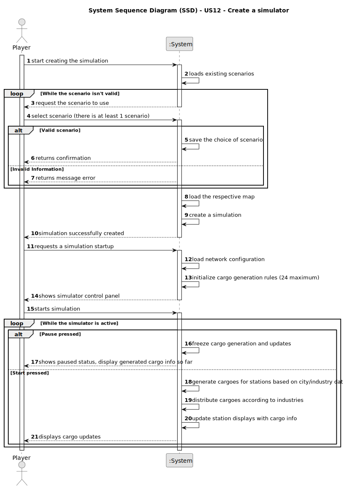

# US12 - Create a simulator

## 1. Requirements Engineering

### 1.1. User Story Description

As a Player, I want to create a simulator that generates cargoes at current stations, automatically, considering the cities and industries that the railway network serves. AC1: This simulator should provide options for start/pause.

### 1.2. Customer Specifications and Clarifications 

>**Question:** A simulação é corrida mapa a mapa ou para todos os mapas existentes?     
>Exemplo: Escolhe correr isoladamente a simulação no mapa da cidade de Lisboa, mas não corre no mapa de Paris. Ou teria que correr necessariamente em todos os mapas?
>Se for mapa a mapa, como é que isso se processa? Corre no mapa em que o Product Owner(Player) está? O Product Owner(Player) seleciona em que mapas quer correr a simulação?
> 
>**Answer:** No contexto da simulation o jogador escolhe um cenário para jogar, associado ao cenário existe obrigatoriamente um mapa. A execução do simulador para uma cenário é designada de simulação.              
>
>[Customer Clarification - Fórum](https://moodle.isep.ipp.pt/mod/forum/discuss.php?d=35113)

>**Question:** Should the simulator run in real-time or in set intervals?
> 
>**Answer:** Not in real-time.                
>
>[Customer Clarification - Fórum](https://moodle.isep.ipp.pt/mod/forum/discuss.php?d=35077)

>**Question:** Can users manually adjust cargo generation rates?
>
>**Answer:** Maybe not the playerExample but generation should be configurable (maybe in a config file).             
>
>[Customer Clarification - Fórum](https://moodle.isep.ipp.pt/mod/forum/discuss.php?d=35077)

>**Question:** Should generated cargo be influenced by train schedules?
>
>**Answer:** There are no train schedules!               
>
>[Customer Clarification - Fórum](https://moodle.isep.ipp.pt/mod/forum/discuss.php?d=35077)

>**Question:** There is a limit to cargo storage?
>
>**Answer:** 24               
>
>[Customer Clarification - Fórum](https://moodle.isep.ipp.pt/mod/forum/discuss.php?d=35086)

>**Question:** How should cargo generation be done? At fixed time intervals or based on specific events (train arrival)?
>
>**Answer:** Accordingly to the frequency defined for the industry and house blocks by the station (the distribution along the year can be fixed or random).               
>
>[Customer Clarification - Fórum](https://moodle.isep.ipp.pt/mod/forum/discuss.php?d=35086)

>**Question:** Should cargo generation dynamically update as the railway network expands or changes?
>
>**Answer:** Yes, the generation is done for the industries and house blocks served by the stations present in the network.                       
>
>[Customer Clarification - Fórum](https://moodle.isep.ipp.pt/mod/forum/discuss.php?d=35048)

>**Question:** Will the user have customization options for cargo generation rules, or will it be fully automated?
>
>**Answer:** Just in the edition of the scenario.                        
>
>[Customer Clarification - Fórum](https://moodle.isep.ipp.pt/mod/forum/discuss.php?d=35048)

>**Question:** How should cargo stockpiling be managed at stations to prevent excessive accumulation?
>
>**Answer:** A maximum number can be considered per cargo type (e.g. 30).            
>
>[Customer Clarification - Fórum](https://moodle.isep.ipp.pt/mod/forum/discuss.php?d=35048)

### 1.3. Acceptance Criteria

> **AC1:** Choice of simulation
>- The simulation will run exclusively for the scenario associated with a map;
>- The playerExample will use a map where the simulation will run without affecting other maps.

> **AC2:** Simulation Timing
>- The simulation will not run in real-time;
>- The simulation will run at set intervals defined by the scenario configuration.

> **AC3:** Cargo Generation Configuration
>- Players cannot manually adjust cargo generation rates;
>- Cargo generation will be configured with predefined parameters within the scenario.

> **AC4:** Generation Based on Events
>- Cargo generation will occur based on the frequency defined for industries and house blocks, and will not depend on events like train arrivals.

> **AC5:** Cargo Storage Limit
>- Each cargo type will have a maximum storage limit (e.g., 24 units per cargo type) to prevent excessive accumulation at stations.

> **AC6:** Dynamic Cargo Generation
>- Cargo generation will automatically update as the railway network expands or changes, reflecting the stations and industries served by the network.

> **AC7:** Scenario Customization
>- Customization of cargo generation rules will only be possible during scenario editing and cannot be adjusted during the simulation execution.

### 1.4. Found out Dependencies

>**US05:** Stations must exist before cargo generation can be associated with them.         
>**US08:** A railway line between stations must exist to allow for the transport of cargo generated in the simulation.         
>**US09:** A locomotive must be available and operational to transport generated cargo once the simulation runs.        
>**US10:** A train must be assigned to a route for cargo to be picked up and delivered as part of the simulation.          
>**US11:** Trains must be listed and identifiable, so they can be used in the simulation process, ensuring cargo transport is handled appropriately.

### 1.5 Input and Output Data

>**Input Data:**
>- Scenario Selection: Player selects one of multiple preconfigured scenarios;
>- Start Command: Player initiates simulation;
>- Pause/Resume: Player toggles simulation state.

>**Output Data:**
>- Cargo Generation: System generates cargo at stations based on scenario-defined frequencies and station coverage;
>- Confirmation Messages: System returns feedback for scenario selection success or failure;
>- Updated Station States: System updates station cargo levels, respecting stockpile limits and reflecting network changes.

### 1.6. System Sequence Diagram (SSD)

### 1.7 Other Relevant Remarks

> **(i) Special Requirements:**
>- The simulator must include start and pause controls to give the playerExample control over simulation flow;
>- Cargo generation must be handled automatically, based on preconfigured frequencies linked to the types of buildings (industries, houses) served by each station;
>- The simulator must enforce stockpile limits per cargo type at each station (e.g., 24 or 30 units depending on the context);
>-The cargo generation algorithm must dynamically adapt to network changes (new stations, changes in service areas).

> **(ii) Data and/or Technology Variations:**
>- The frequency and behavior of cargo generation may vary depending on the scenario configuration and can be either fixed or randomized along the simulated year;
>- Cargo generation must be decoupled from real-time constraints and operate on discrete simulation ticks or time steps.

> **(iii) How often this US is held:**
>- This user story is invoked at the beginning of a scenario when the simulation is started;
>- The simulator runs continuously throughout gameplay, as long as the simulation is active;
>- It is expected to be used in every scenario, since it drives the core mechanic of cargo availability across the map.