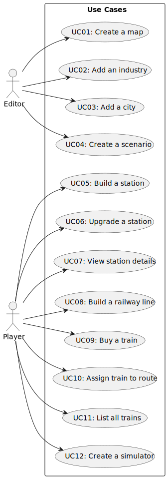

# Use Case Diagram (UCD)

**In the scope of this project, there is a direct relationship of _1 to 1_ between Use Cases (UC) and User Stories (US).**

# Use Cases / User Stories
| UC/US | Description                                        |                   
|:------|:---------------------------------------------------|
| US01  | [Create a map](../../US01/US01-README.md)          |
| US02  | [Add an industry](../../US02/US02-README.md)       |
| US03  | [Add a city](../../US03/US03-README.md)            |
| US04  | [Create a scenario](../../US04/US04-README.md)     |
| US05  | [Build a station](../../US05/US05-README.md)       |
| US06  | [Upgrade a station](../../US06/US06-README.md)     |
| US07  | [View station details](../../US07/US07-README.md)  |
| US08  | [Build a railway line](../../US08/US08-README.md)  |
| US09  | [Buy a locomotive](../../US09/US09-README.md)      |
| US10  | [Assign Train to Route](../../US10/US10-README.md) |
| US11  | [List all trains](../../US11/US11-README.md)       |
| US12  | [Create a simulator](../../US12/US12-README.md)    |

