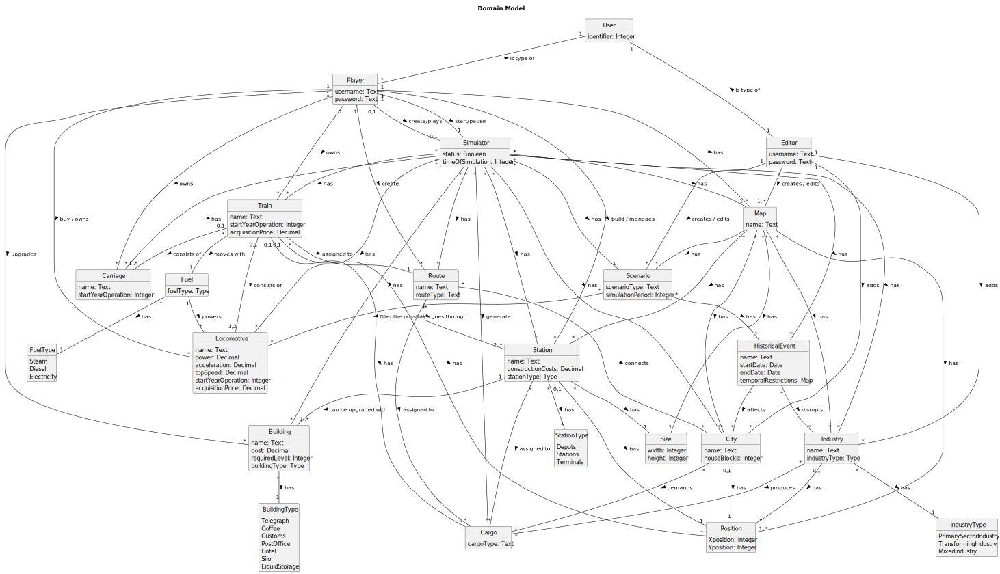

# OO Analysis

## Rationale to identify domain conceptual classes

### _Conceptual Class Category List_

**Business Transactions**
>Station Construction 

>Building Upgrade 

>Railway Line Construction 

>Locomotive Purchase 
---

**Transaction Line Items**
> Locomotives

> Cargo 

> Buildings
---

**Product/Service related to a Transaction or Transaction Line Item**
>**Locomotive**
> 
>US09: Players buy locomotives.

>**Carriage**
> 
>US10: Attached to trains for cargo transport.
---

**Transaction Records**
>Simulation Log

>Route Assignments
---  

**Roles of People or Organizations**
>**Editor - Person who can create maps and scenarios that can be
provided in a bundle with the game or sold separately.**
> 
> * US01: Creat a map
> * US02: Add an industry
> * US03: Add a city
> * US04: Create a scenario

>**Player - Person who wants to play a game; in advanced versions, a
scenario can be played by multiple players simultaneously.**
> 
> * US05: Build a station
> * US06: Upgrade a selected station with a building
> * US07: List all the stations to select one to see its details
> * US09: Buy a locomotive
> * US10: Assign a train to a route with cargo pickups
> * US12: Create a simulator

>**• Product Owner - the person representing the organization that intends to develop the game.**
---

**Places**
>Map

>City

>Stations

---

**Noteworthy Events**
> Train Route

> Cargo Delivered

>Cargo Generated
 
> Scenario Event

> Historical Event
---

**Physical Objects**
>Industry

>Train

>Cargo

>Station

>RailwayLine

---

**Descriptions of Things**
> Types of industries

> Types of stations

> Types of locomotives

> Types of cargo

---

**Catalogs**
>List of available industries: Primary sector industries, Transforming industries, Mixed industries

>List of available stations: Depot, Station, Terminal
 
>List of available locomotives: Steam, Diesel, Electric

>List of available carriages: Passengers, Mail, Resources
---

**Containers**
> Map
---

**Elements of Containers**
>City

>Industry

>Station
---

**(Other) Organizations**
* None explicitly mentioned
---

**Other (External/Collaborating) Systems**
* None explicitly mentioned
---

**Records of finance, work, contracts, legal matters**
* None explicitly mentioned
---

**Financial Instruments**
>In-game currency
---

**Documents mentioned/used to perform some work**

>[T02 - Requirements Engineering.pdf](https://moodle.isep.ipp.pt/pluginfile.php/441555/mod_resource/content/4/T02%20-%20Requirements%20Engineering.pdf)

>[Capturing Architectural Requirements (FURPS+)](https://moodle.isep.ipp.pt/pluginfile.php/441563/mod_resource/content/1/Capturing%20Architectural%20Requirements.pdf)

>[T03 - OO Analysis.pdf](https://moodle.isep.ipp.pt/pluginfile.php/441568/mod_resource/content/6/T03%20-%20OO%20Analysis.pdf)
 
>[TP04 - OO Analysis.pdf](https://moodle.isep.ipp.pt/pluginfile.php/441572/mod_resource/content/5/TP04%20-%20OO%20Analysis.pdf)

>[sem2_pi_2024_25_v1_1.pdf](https://moodle.isep.ipp.pt/mod/resource/view.php?id=261025)
---

## Rationale to identify associations between conceptual classes

| Concept (A)         |       Association            |     Concept (B)     |
|---------------------|:----------------------------:|---------------------:|
| Simulator           |             has              |           Industry   |
| Simulator           |             has              |               City   |
| Simulator           |             has              |               Map    |
| Simulator           |             has              |          Scenario    |
| Simulator           |             has              |              Train   |
| Simulator           |             has              |           Station    |
| Simulator           |             has              |           Building   |
| Simulator           |             has              |             Route    |
| Simulator           |         generates            |             Cargo    |
| Simulator           |             has              |   HistoricalEvent    |
| Simulator           |             has              |         Locomotive   |
| Simulator           |             has              |           Carriage   |
| Simulator           |     creates/plays            |            Player    |
| User                |         is type of           |            Player    |
| User                |         is type of           |            Editor    |
| Player              |       start/pause            |         Simulator    |
| Player              |     build / manages          |           Station    |
| Player              |            owns              |              Train   |
| Player              |         upgrades             |           Building   |
| Player              |             has              |               Map    |
| Player              |           create             |             Route    |
| Player              |            owns              |           Carriage   |
| Player              |       buy / owns             |         Locomotive   |
| Editor              |            adds              |           Industry   |
| Editor              |            adds              |               City   |
| Editor              |      creates / edits         |               Map    |
| Editor              |      creates / edits         |          Scenario    |
| Map                 |             has              |              Size    |
| Map                 |             has              |           Station    |
| Map                 |             has              |              City    |
| Map                 |             has              |          Scenario    |
| Map                 |             has              |           Industry   |
| Map                 |             has              |           Position   |
| Scenario            |             has              |   HistoricalEvent    |
| Scenario            | filter the possible          |         Locomotive   |
| HistoricalEvent     |          affects             |              City    |
| HistoricalEvent     |         disrupts             |           Industry   |
| Train               |             has              |             Cargo    |
| Train               |       moves with             |              Fuel    |
| Train               |      consists of             |         Locomotive   |
| Train               |      consists of             |           Carriage   |
| Train               |       assigned to            |             Route    |
| Train               |             has              |           Position   |
| Route               |      assigned to             |             Cargo    |
| Route               |       goes through           |           Station    |
| Route               |         connects             |              City    |
| Fuel                |             has              |          FuelType    |
| Fuel                |           powers             |         Locomotive   |
| Station             |       assigned to            |             Cargo    |
| Station             |             has              |        StationType   |
| Station             | can be upgraded with         |           Building   |
| Station             |             has              |           Position   |
| Station             |             has              |              Size    |
| Building            |             has              |      BuildingType    |
| Industry            |             has              |           Position   |
| Industry            |             has              |      IndustryType    |
| Industry            |         produces             |             Cargo    |
| City                |             has              |           Position   |
| City                |          demands             |             Cargo    |

## Domain Model

**Concept Attributes**

>**User:**
>- identifier

>**Editor:**
>- username
>- password

>**Player:**
>- username
>- password

>**Map:**
>- name

>**Scenario:** 
>- scenarioType
>- simulationPeriod

>**HistoricalEvent:**
>- name
>- startDate
>- endDate
>- temporalRestrictions

>**Train:** 
>- name
>- startYearOperation
>- acquisitionPrice

>**Locomotive:**
>- name
>- power
>- acceleration
>- topSpeed
>- startYearOperation
>- acquisitionPrice

>**Carriage:**
>- name
>- startYearOperation

>**Route:**
>- name
>- routeType

>**Cargo:**
>- cargoType

>**Fuel:**
>- fuelType

>**Station:**
>- name
>- constructionCosts
>- stationType

>**Building:**
>- name
>- cost
>- requiredLevel
>- buildingType

>**Industry:** 
>- name
>- industryType

>**City:**
>- name
>- houseBlocks

>**Size:**
>- width
>- height

>**Position:**
>- Xposition
>- Yposition

