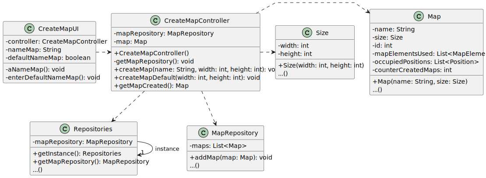
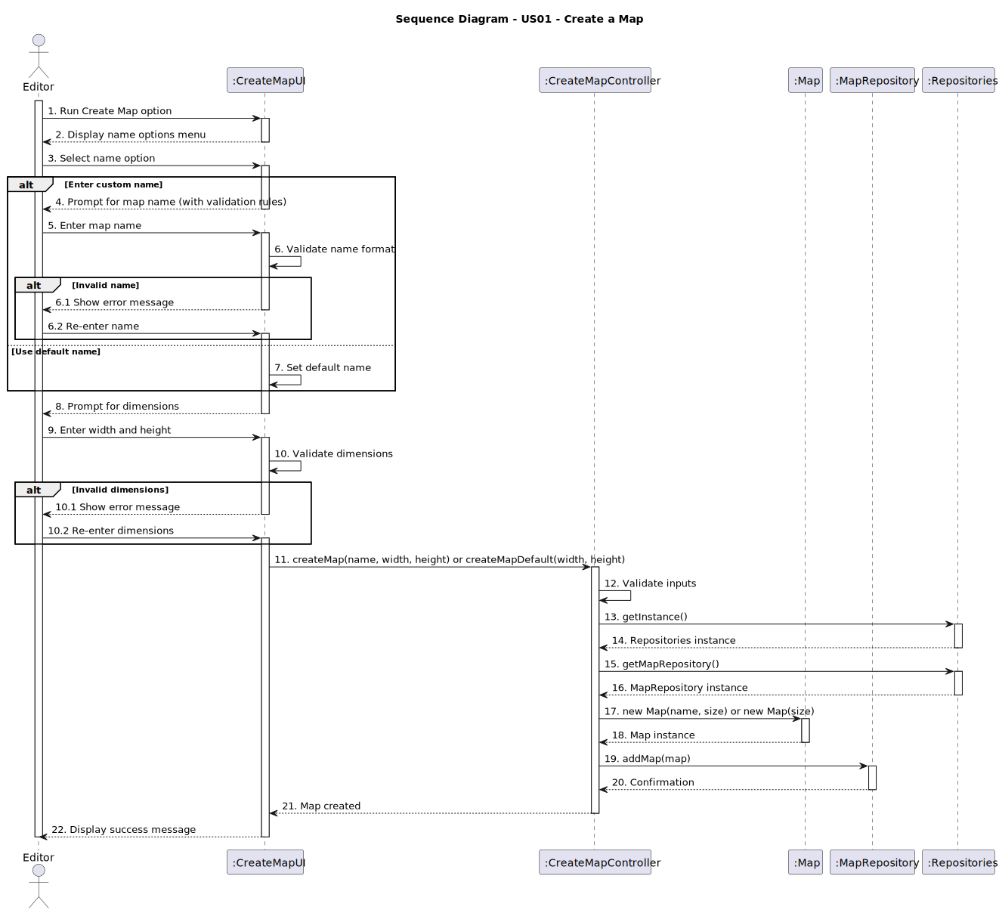

# USXXX - YYY

_XXX stands for User Story number and YYY for User Story description (e.g. US006 - Create a Task)_

## 3. Design

### 3.1. Rationale

**The rationale grounds on the SSD interactions and the identified input/output data.**

| Interaction ID | Question: Which class is responsible for... | Answer  | Justification (with patterns) |
|:-------------  |:--------------------- |:------------|:------------------------------|
| Step 1  		 |... interacting with the actor?|CreateMapUI| Pure Fabrication: Responsible for user interaction.                             |
|                |... coordinating the use case?|CreateMapController|Controller: Coordinates logic and delegates responsibilities.|
| Step 2  		 |.. prompting for map name option?|CreateMapUI|IE: UI gathers input.|
|                |	... processing map name (custom or default)?|CreateMapUI|IE: Validates and sets the name based on user input or default.|
| Step 3  		 |... validating map name format?|CreateMapUI|	IE: Ensures input meets validation rules.|
| Step 4  		 |	... prompting for map dimensions?|CreateMapUI|	IE: UI gathers width and height inputs.|
|                |... validating map dimensions?|CreateMapUI|IE: Validates dimension inputs.|
| Step 5  		 |... creating the map domain object?|CreateMapController|Creator: Constructs Map instance with given name and size.|
| Step 6  		 |	... retrieving repository instance?|Repositories|	Singleton: Provides access to repositories.|              
| Step 7  		 |... retrieving the map repository?|Repositories|IE: Provides MapRepository instance.|
| Step 8  		 |... adding the created map to repository?|MapRepository|IE: Manages map persistence and uniqueness.|
| Step 9  		 |IE: Manages map persistence and uniqueness.|CreateMapUI|	IE: Handles user feedback and displays operation results.|

### Systematization ##

According to the taken rationale, the conceptual classes promoted to software classes are:

* Map
* Size

Other software classes (i.e. Pure Fabrication) identified:

* CreateMapUI
* CreateMapController
* Repositories
* MapRepository

## 3.2. Sequence Diagram (SD)

This diagram shows the complete sequence of interactions that allow the Editor to create a new map.

## 3.3. Class Diagram (CD)

The class diagram presents the software classes and their main relations, attributes, and responsibilities involved in fulfilling the user story.

