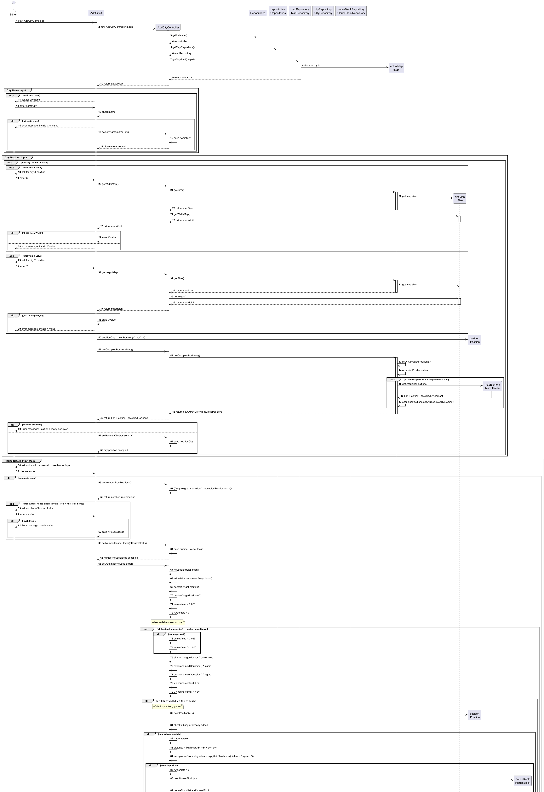
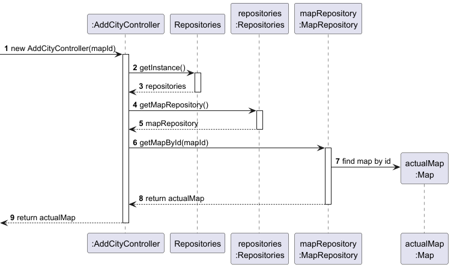
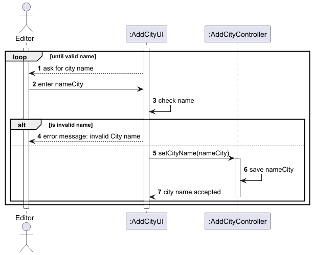
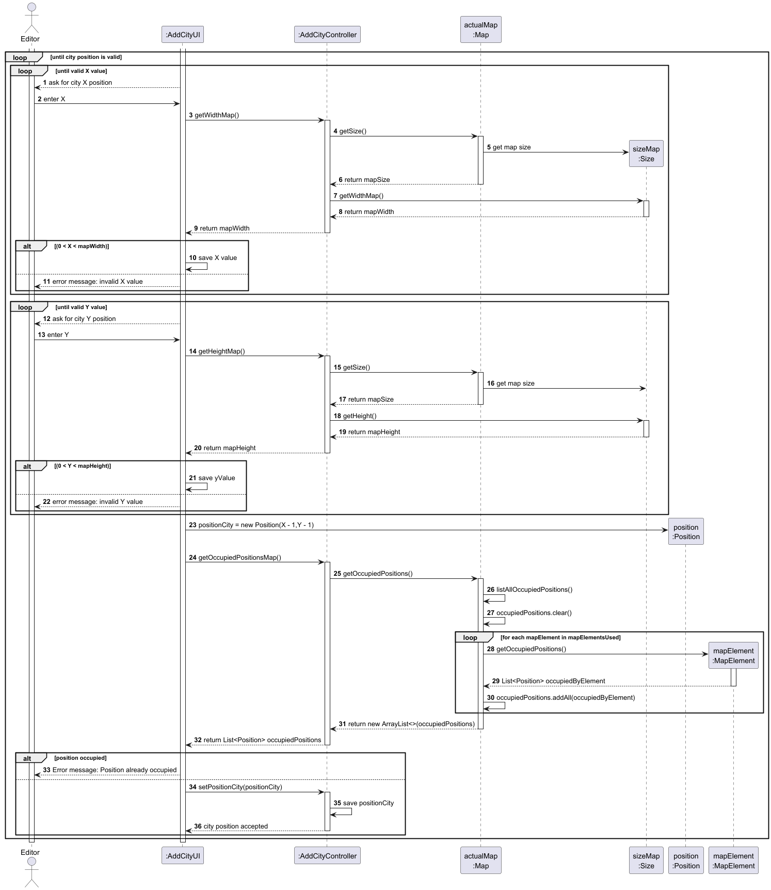
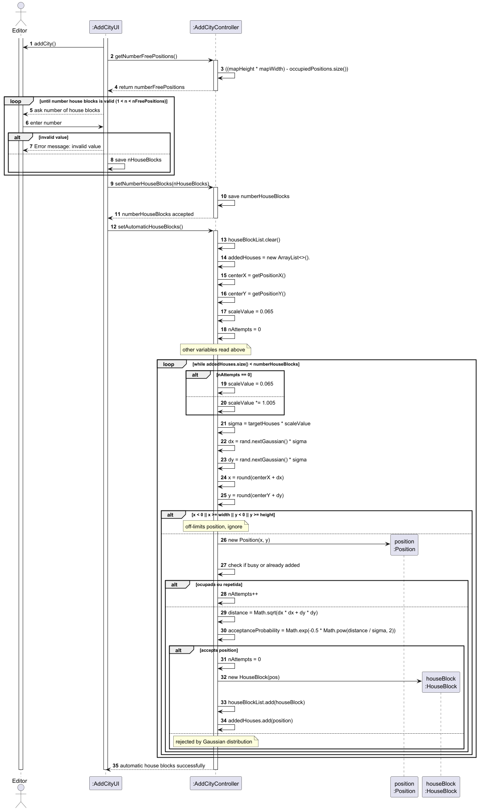
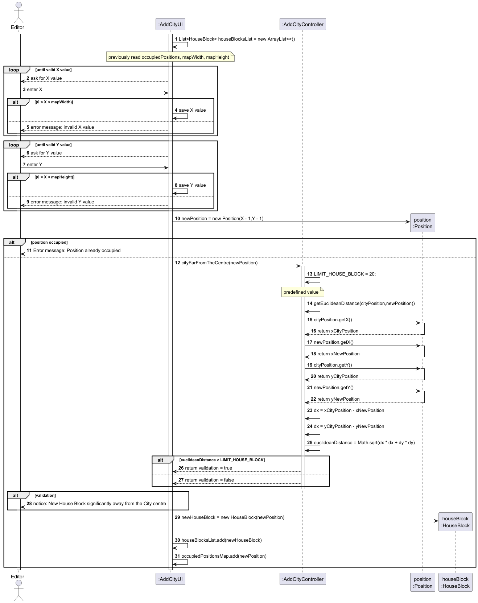
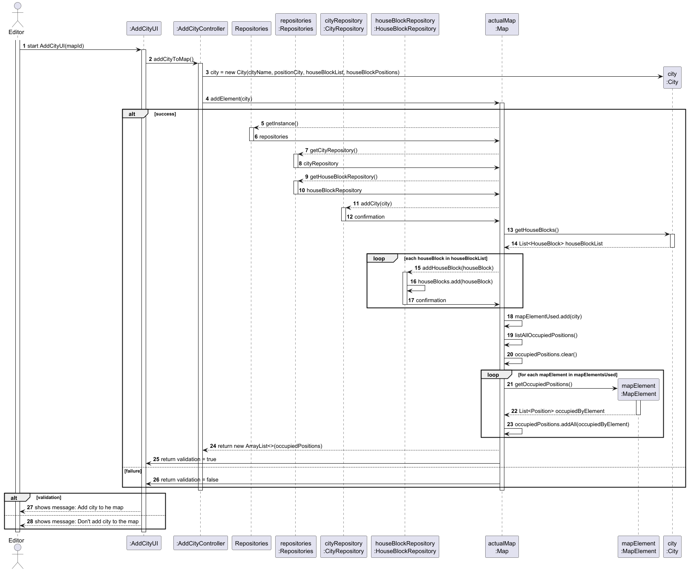
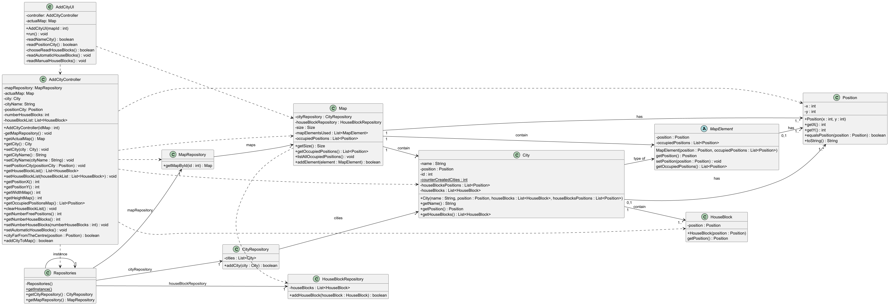

# US03 - Add a City

## 3. Design

### 3.1. Rationale

| Interaction ID | Question: Which class is responsible for...        | Answer                 | Justification (with patterns)                                                                                                       |
|:---------------|:---------------------------------------------------|:-----------------------|:------------------------------------------------------------------------------------------------------------------------------------|
| Step 1         | ... interacting with the actor?                    | AddCityUI              | Pure Fabrication: there is no reason to assign this responsibility to any existing class in the Domain Model.                       |
|                | ... coordinating the US?                           | AddCityController      | Controller                                                                                                                          |
|                | ... knowing the map data?                          | MapRepository          | IE: the repository knows and provides maps.                                                                                         |
| Step 2         | ... validating city name format?                   | AddCityUI              | IE: local validation of user input.                                                                                                 |
|                | ... checking name uniqueness?                      | CityRepository         | IE: manages and knows all cities.                                                                                                   |
| Step 3         | ... validating position coordinates?               | AddCityUI              | IE: local validation, with Map support.                                                                                             |
|                | ... checking position availability?                | Map                    | IE: knows occupied positions.                                                                                                       |
| Step 4         | ... handling input mode selection?                 | AddCityUI              | IE: user interaction.                                                                                                               |
| Step 5a        | ... generating automatic house blocks?             | AddCityController      | Pure Fabrication: automatic generation algorithm.                                                                                   |
| Step 5b        | ... validating manual positions?                   | AddCityUI              | IE: immediate feedback to the user.                                                                                                 |
| Step 6         | ... instantiating City?                            | City                   | Creator: the city is created with the collected data.                                                                               |
|                | ... managing house blocks?                         | City                   | IE: the city owns its blocks.                                                                                                       |
| Step 7         | ... adding to map?                                 | Map                    | IE: manages map elements.                                                                                                           |
|                | ... persisting city?                               | CityRepository         | IE: responsible for storing cities.                                                                                                 |
|                | ... persisting house blocks?                       | HouseBlockRepository   | IE: responsible for storing blocks.                                                                                                 |
| Step 8         | ... informing operation success?                   | AddCityUI              | IE: responsible for user interactions.                                                                                              |

### Systematization

According to the rationale above, the conceptual classes promoted to software classes are:

* Map
* City
* HouseBlock
* Position
* Size

Other software classes (Pure Fabrication):

* AddCityUI
* AddCityController
* Repositories
* MapRepository
* CityRepository
* HouseBlockRepository

## 3.2. Sequence Diagram (SD)

### Full Diagram

This diagram shows the full sequence of interactions between the classes involved in the realization of this user story.

### Split Diagrams

The following diagrams show the same sequence, but split into parts to better illustrate the interactions:

- **Get Map:**

- **City Name Input:**

-**City Position Input:**

- **Automatic House Blocks Generation:**

- **Manual House Blocks Generation:**

- **Persistence:**

## 3.3. Class Diagram (CD)

The class diagram shows the main relationships between the domain and application layer classes.

