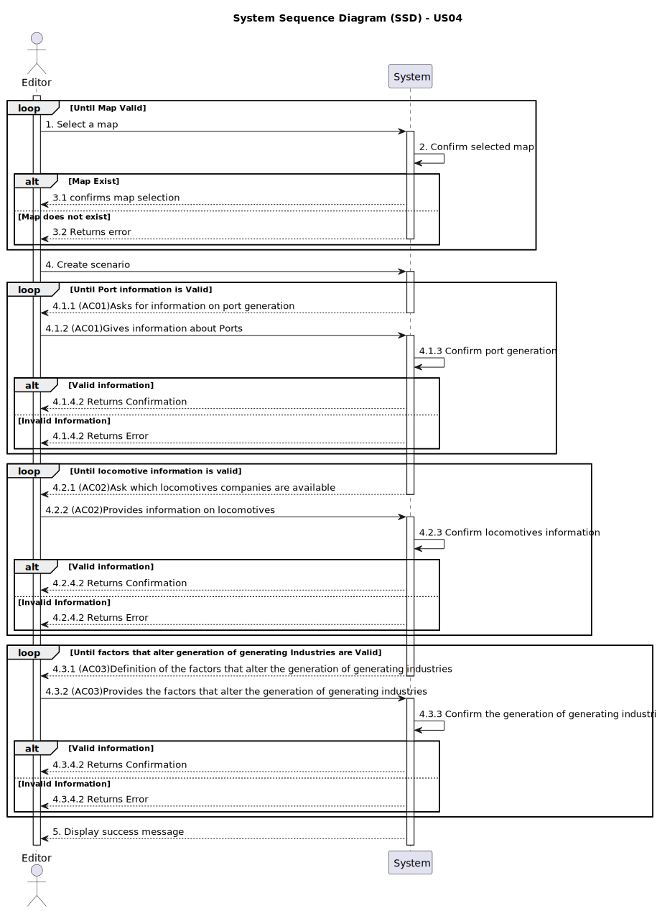

\# US04 - Create a Scenario for a selected Map

## 1. Requirements Engineering

### 1.1. User Story Description

> As an Editor, I want to create a scenario for a selected map.
### 1.2. Customer Specifications and Clarifications

### Customer enquiries
>**Question:** In the acceptance criterion 3, it talks about "the factors that alter the generation (frequency) of generating industries", what exactly are these factors? Are we talking about the rate at which these industries produce resources? or is it something else? 
> Also, are we supposed to give the editor the freedom to edit the generation rate of of each generating industry or is it 1 rate for all the generating industries?
>
>**Answer:** The generation rates of the industries can be defined in a configuration file, it is not expected that there will be any US to edit them.
Each entry must define the industry and the number of cargos generated per unit of time like year or month.
(e.g., CoalMine, 4) A factor allows you to change this rate as a percentage.
(e.g., CoalMine, 50%) meaning that the coal mine will now produce 6 cargos per unit of time.
>
> [Customer Specification - Integrative Project Assignment (Version 1.1)](https://moodle.isep.ipp.pt/mod/resource/view.php?id=261025)

>**Question:** According to User Story 3, the name of the city must be unique within the same map?
>
>**Answer:** It can be repeated but can become confusing for players, the editor should be alerted to the situation.
>
> [Customer Clarification - Fórum](https://moodle.isep.ipp.pt/mod/forum/discuss.php?d=35050)

### 1.3. Acceptance Criteria

>AC1: Definition of the behaviour of ports, which cargoes they import/export and/or transform;

>AC2: Definition of the available locomotion types (steam, diesel, and/or electric);

>AC3: (Re)Definition of the factors that alter the generation (frequency) of generating industries;

### 1.4. Found out Dependencies

>This User Story depends on US01:

>US01 - Create a map with size and name.
>- Dependency: US04 depends on US01 to ensure there is a valid map where the scenario can be added.

### 1.5 Input and Output Data

>For US04, the editor choose the map, gives the information about the port, Locomotion Types and Industry Generation Factors

>The system outputs a confirmation message upon successful scenario creation. If there is an error when creating the scenario, error messages are transmitted

### 1.6. System Sequence Diagram (SSD)

### 1.7 Other Relevant Remarks

>(i) Special requirements;  
> 
>* The availability of types of locomotion must be compatible with technological restrictions.

>(ii) Data and/or technology variations;  
> 
>* Data variations include scenario-specific restrictions, such as locomotives unavailable outside their operational timeline

>(iii) How often this US is held;
> 
>* This user story is executed during the initial creation of a scenario for a map. Editors may use it frequently when new scenarios with maps.