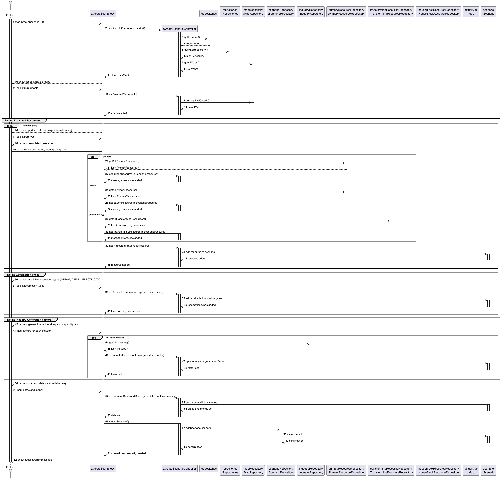
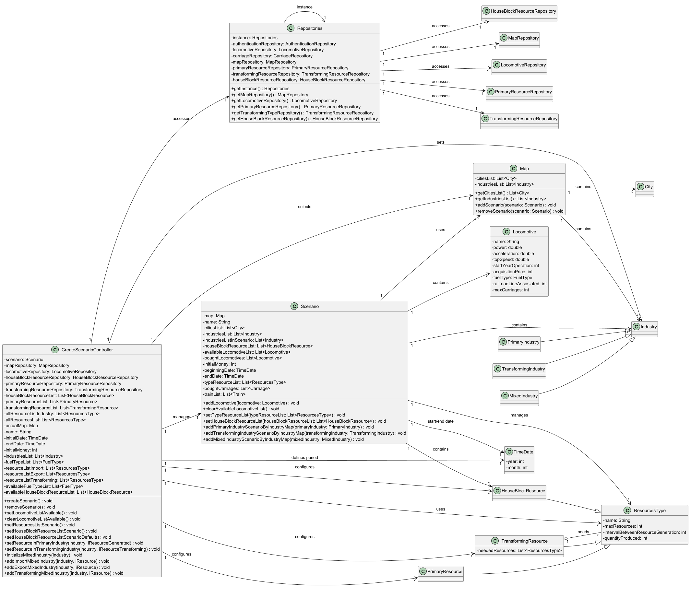

# US04 - Create a Scenario

## 3. Design

### 3.1. Rationale

| Interaction ID | Question: Which class is responsible for... | Answer | Justification (with patterns) |
|:-------------- |:--------------------------------------------|:-------|:-----------------------------|
| Step 1         | ... interacting with the actor?              | CreateScenarioUI | Pure Fabrication: UI handles user interaction. |
|                | ... coordinating the US?                    | CreateScenarioController | Controller: coordinates the scenario creation process. |
|                | ... providing available maps?               | MapRepository | IE: repository knows all maps. |
| Step 2         | ... selecting a map?                        | CreateScenarioController | Controller: manages selection logic. |
|                | ... retrieving a map by id?                 | MapRepository | IE: repository provides map access. |
| Step 3         | ... configuring ports and resources?         | CreateScenarioUI | IE: user input. |
|                | ... providing available resources?           | PrimaryResourceRepository, TransformingResourceRepository, HouseBlockResourceRepository | IE: repositories manage resources. |
|                | ... adding resources to scenario?            | CreateScenarioController | Controller: manages scenario state. |
| Step 4         | ... configuring locomotion types?            | CreateScenarioUI | IE: user input. |
|                | ... updating scenario with locomotion types? | CreateScenarioController | Controller: updates scenario. |
| Step 5         | ... configuring industry generation factors? | CreateScenarioUI | IE: user input. |
|                | ... updating scenario with factors?          | CreateScenarioController | Controller: updates scenario. |
| Step 6         | ... setting scenario dates and money?        | CreateScenarioUI | IE: user input. |
|                | ... updating scenario with dates/money?      | CreateScenarioController | Controller: updates scenario. |
| Step 7         | ... instantiating Scenario?                  | Scenario | Creator: scenario aggregates all data. |
| Step 8         | ... persisting scenario?                     | ScenarioRepository | IE: repository stores scenarios. |
| Step 9         | ... informing operation success?             | CreateScenarioUI | IE: UI provides feedback. |

### Systematization

According to the rationale above, the conceptual classes promoted to software classes are:

* Map
* Scenario
* Industry
* ResourcesType
* Locomotive
* HouseBlockResource
* PrimaryResource
* TransformingResource

Other software classes (Pure Fabrication):

* CreateScenarioUI
* CreateScenarioController
* Repositories
* MapRepository
* ScenarioRepository
* IndustryRepository
* PrimaryResourceRepository
* TransformingResourceRepository
* HouseBlockResourceRepository

## 3.2. Sequence Diagram (SD)

The following diagram shows the full sequence of interactions between the classes involved in the realization of this user story.

## 3.3. Class Diagram (CD)

The class diagram below shows the main relationships between the domain and application layer classes involved in this user story.

