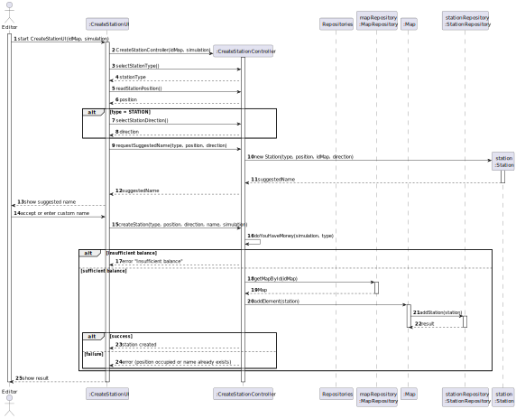
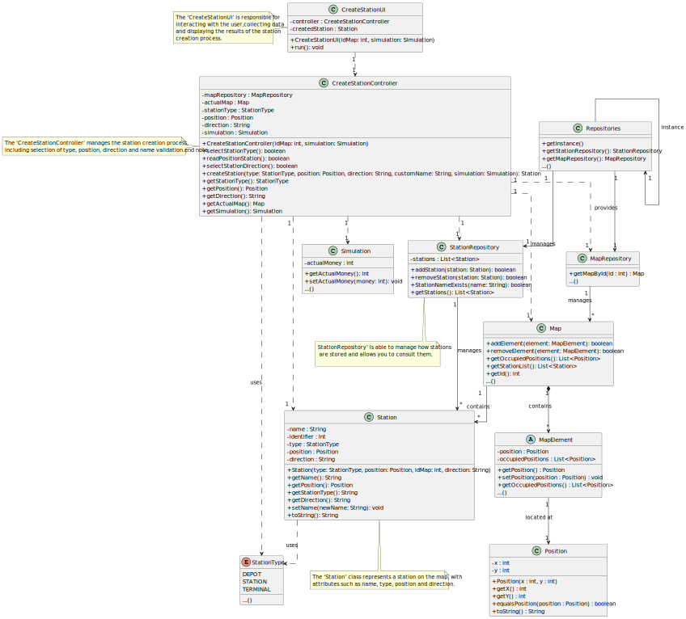

# US05 - As a Player, I want to build a station.

## 3. Design

### 3.1. Rationale

**The rationale grounds on the SSD interactions and the identified input/output data.**

| Interaction ID | Question: Which class is responsible for...              | Answer                  | Justification (with patterns)                                 |
| :------------- |:---------------------------------------------------------| :---------------------- | :------------------------------------------------------------ |
| Step 1         | ... interacting with the actor?| CreateStationUI         | Pure Fabrication: Responsible for user interaction.           |
|                | ... coordinating the use case?| CreateStationController | Controller: Coordinates logic and delegates responsibilities. |
| Step 2         | ... prompting for station type?| CreateStationUI         | IE: UI gathers input.|
|                | ... processing station type?| CreateStationController | IE: Interprets selected type and stores in context.           |
| Step 3         | ... prompting for position?| CreateStationUI         | IE: UI gathers input.       |
|                | ... processing position?| CreateStationController | IE: Handles the position logic.|
| Step 4         | ... prompting for direction (if applicable)?| CreateStationUI         | IE: UI handles interaction.|
|                | ... processing direction?| CreateStationController | IE: Logic to apply direction to the station.|
| Step 5         | ... suggesting a station name?| CreateStationController | Creator: Uses Station constructor to generate suggestion.     |
|                | ... instantiating station for name suggestion?| Station                 | Creator: Suggested name logic encapsulated in Station class.  |
| Step 6         | ... checking balance before building?| CreateStationController | IE: Determines if simulation allows the operation.|
|                | ... providing current balance?| Simulation              | IE: Holds current funds.|
| Step 7         | ... retrieving the map?| MapRepository           | IE: Provides map from ID.|
| Step 8         | ... adding station to the map?| Map                     | IE: Holds map elements and ensures spatial consistency.       |
| Step 9         | ... persisting the station?| StationRepository       | IE: Manages station storage and uniqueness validation.|
| Step 10        | ... returning the result (success or error) to the user? | CreateStationUI| IE: Handles all user-visible feedback. |

### Systematization ##

According to the taken rationale, the conceptual classes promoted to software classes are:

* Station
* Map
* Simulation
* Position
* StationType

Other software classes (i.e. Pure Fabrication) identified:

* CreateStationUI
* CreateStationController
* MapRepository
* StationRepository
* Repositories

## 3.2. Sequence Diagram (SD)

This diagram shows the complete sequence of interactions that allow the user to upgrade a station with a building.

## 3.3. Class Diagram (CD)

The class diagram presents the software classes and their main relations, attributes, and responsibilities involved in fulfilling the user story.

