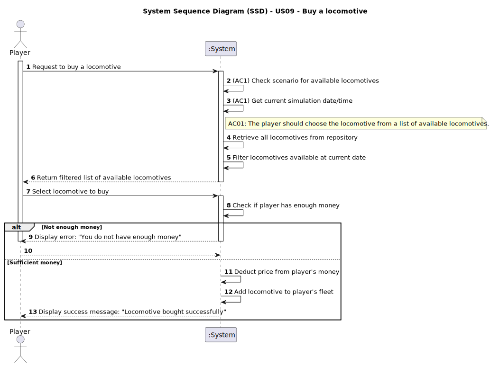

# US09 - Buy a locomotive

## 1. Requirements Engineering

### 1.1. User Story Description

>As a Player, I want to buy a locomotive.

### 1.2. Customer Specifications and Clarifications 

>**Question:** Question: How is the availability of locomotives determined?
> 
>Question: Monetary data is expressed in any particular currency?
> 
>Question: What happens if the playerExample does not have enough budget to buy a locomotive?
> 
>Question: Is there a limit to the number of locomotives a playerExample can buy?
> 
>Question: Why is the current date required when buying a locomotive?
>
>**Answer:** Each locomotive model has a one-year entry into service period, after which it becomes available for purchase.
>
>An abstract one.
>
>He can't buy! Bonds and loans will not be considered right now.
>
>No limit.
>
>Already answered in the first point.
> 
>[Customer Clarification - Fórum](https://moodle.isep.ipp.pt/mod/forum/discuss.php?d=35218) 

>**Question:** I have checked that in the US in question there is a dependency relating to a list of locomotives available for the current scenario and date. However, I haven't found any specific User Story that deals with building or displaying this list. Will this listing functionality be detailed in a future US?
>
>**Answer:** The locomotives that will be presented in the selection list are restricted to the current date and any restrictions that may have been defined in the scenario.
The presentation of the list of locomotives is part of US09.
> 
> [Customer Clarifications - Fórum](https://moodle.isep.ipp.pt/mod/forum/discuss.php?d=35173)

>**Qustion:** Can a playerExample buy the same train multiple times?
> 
>**Answer:** the same type of locomitve, yes; but these locomotives will have unique identification (like a plate or a serial number)
> 
> [Customer Clarifications - Fórum](https://moodle.isep.ipp.pt/mod/forum/discuss.php?d=35148)

>**Qustion:** Is there a limit to how many trains a playerExample can own, like a inventory that can get full?
> 
>**Answer:** there is no physical limit, just the available memory.
> 
> [Customer Clarifications - Fórum](https://moodle.isep.ipp.pt/mod/forum/discuss.php?d=35146)

>**Qustion:** Can the player purchase multiple locomotives at once?
> 
> **Answer:** not planned.
> > [Customer Clarifications - Fórum](https://moodle.isep.ipp.pt/mod/forum/discuss.php?d=35874)

>**Qustion:** What is the price for an electrical, diesel, or steam locomotive?
> 
> **Answer:** The price depends on the locomotive model, not in the locomotion type, please refer to game wiki.
> 
> [Customer Clarifications - Fórum](https://moodle.isep.ipp.pt/mod/forum/discuss.php?d=35895)

### 1.3. Acceptance Criteria

>**AC1:** The playerExample should choose the locomotive from a list of available locomotives for the scenario as well as a current date.

### 1.4. Found out Dependencies

>**US04:** Determines which locomotive types (steam/diesel/electric) are available in the current scenario.

### 1.5 Input and Output Data

>**Input Data:**  
>For US09, the player must select a locomotive from a filtered list of available locomotives based on the current scenario and date, and confirm the purchase.

>**Output Data:**  
>If the purchase is successful, the system provides a confirmation message with the locomotive’s details and the updated player budget. If the purchase fails (e.g., insufficient funds), an error message is displayed.

### 1.6. System Sequence Diagram (SSD)

### 1.7 Other Relevant Remarks

>**(i) Special requirements**
>- The list of locomotives must be dynamically filtered according to the technological constraints of the scenario (e.g., availability of steam/diesel/electric locomotives) and according to the historical timeline.
>- The system should check the player’s budget before the purchase and deduct the cost after confirmation.
