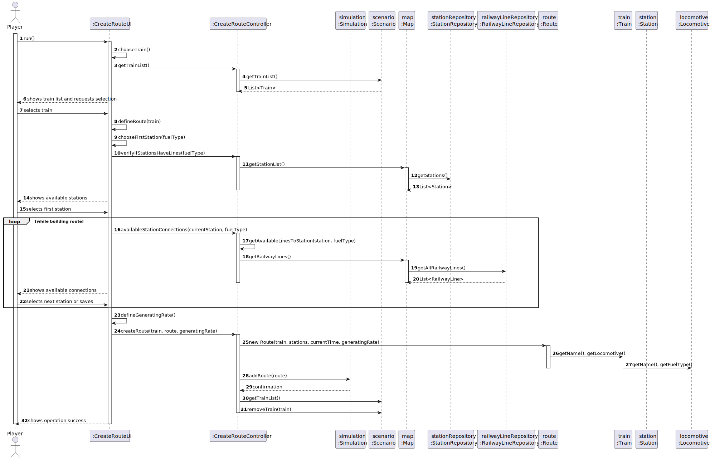
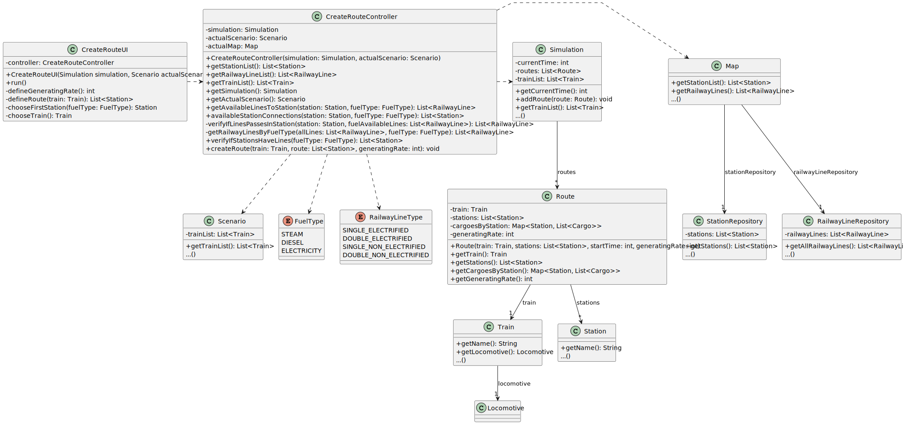

# US10 - Assign train to route

## 3. Design

### 3.1. Rationale

**The rationale grounds on the SSD interactions and the identified input/output data.**

| Interaction ID | Question: Which class is responsible for... | Answer                          | Justification (with patterns)  |
|:-------------  |:--------------------- |:--------------------------------|:---------------------------- |
| Step 1  		 |				Initiating the use case and interacting with the user?			 | CreateRouteUI                   |                	Controller pattern (UI component handling user interaction and coordinating with controller).              |
| Step 2  		 |				Getting the list of trains available to assign?				 | CreateRouteController           |               Controller delegates to domain class (delegation pattern).               |
| Step 3  		 |					Retrieving the list of trains from the simulation state?			 | CreateRouteController           |                It delegates the request to the domain (Scenario) for encapsulation of logic.              |
| Step 4  		 |				Managing and returning the train list for the scenario?			 | Scenario                        |               	Information Expert: holds the train list and provides access through getTrainList().               |
| Step 5  		 |					Allowing the user to choose a train and defining its route?			 | CreateRouteUI                   |                The UI guides the user in the process of building the route through several steps.              |
| Step 6  		 |				Choosing the first station based on the train's fuel type?				 | CreateRouteUI                   |                 It collects this input from the user.             |              
| Step 7  		 |					Determining which stations have lines compatible with the fuel type?			 | CreateRouteController           |                	The controller filters stations based on available railway lines and fuel type.              |
| Step 8  		 |			Getting all stations from the simulation map?				 | Map                             |              	Information Expert: encapsulates access to StationRepository.                |
| Step 9  		 |			Providing the actual station data from storage?				 | StationRepository               |                Pure Fabrication: manages collection of station data and retrieval.              |
| Step 10  		 |					Displaying stations to the player and collecting the selected starting station?			 | CreateRouteUI                   |               Boundary/UI responsibility.               |  
| Step 11  		 |				Iteratively requesting available connections from current station (route building loop)?				 | CreateRouteUI                   |             	The UI controls the loop and calls the controller for valid connections.                 |
| Step 12  		 |			Computing available station connections based on fuel and lines?				 | CreateRouteController           |              ler	Responsible for business logic of filtering possible connections.                |
| Step 13  		 |				Accessing all railway lines for filtering?				 | Map                             |                 	Information Expert: exposes getRailwayLines().             |
| Step 14  		 |			Providing actual railway line data?				 |              RailwayLineRepository                   |               Pure Fabrication: stores and returns all available railway lines.               |
| Step 15  		 |				Finalizing the station list and defining the generating rate?				 |               CreateRouteUI                  |                 UI gathers the route and the generation frequency for cargo.             |
| Step 16  		 |				Creating the route based on the chosen train, stations, current time, and rate?				 |                 CreateRouteController                |                  Application logic that coordinates instantiating the route and updating simulation state.            |
| Step 17  		 |					Instantiating the Route domain object with relevant data (train, stations, time, rate)?			 |             Route                    |              	Creator: it is responsible for initializing its attributes and internal structure.                |
| Step 18  		 |				Accessing train and locomotive details during route creation (e.g., name, fuel type)?				 |              Train, Locomotive                   |          Information Experts: encapsulate domain-specific data used by the Route.                    |
| Step 19  		 |				Storing the created route in the simulation state?				 |               Simulation                  |            	Information Expert: manages the list of all created routes.                  |
| Step 20  		 |				Removing the train from the list of available trains?			 |                    Scenario             |              Scenario is responsible for managing the current availability of trains.                |
| Step 21  		 |				Confirming the success of the operation to the user?				 |               CreateRouteUI                  |             UI is responsible for user feedback.                 |

### Systematization ##

According to the taken rationale, the conceptual classes promoted to software classes are:

* Train
* Station
* Route
* Simulation
* Scenario
* Map

Other software classes (i.e. Pure Fabrication) identified:

* CreateRouteUI
* CreateRouteController

## 3.2. Sequence Diagram (SD)

## 3.3. Class Diagram (CD)

