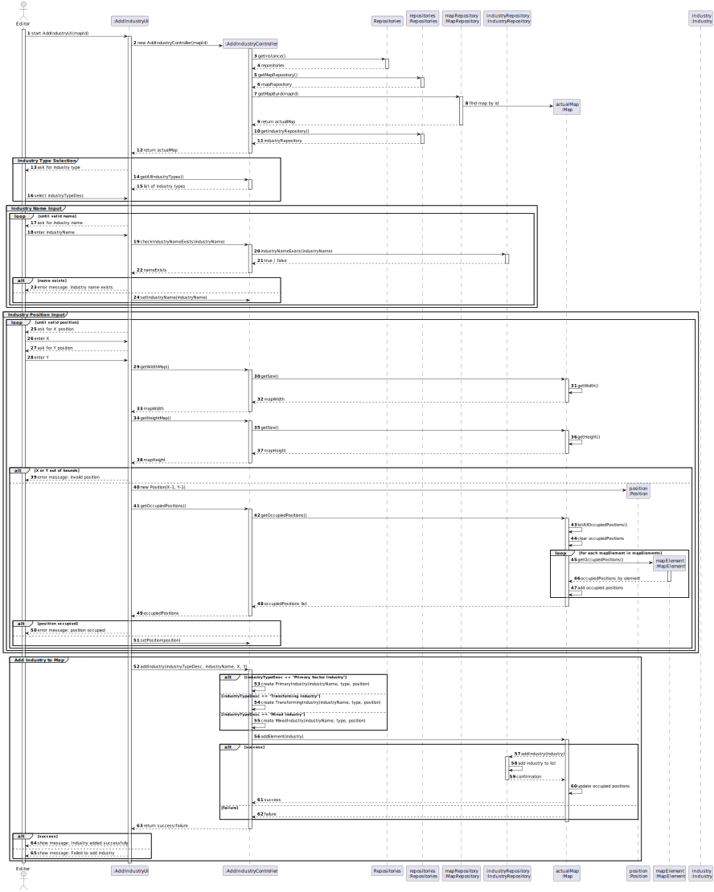
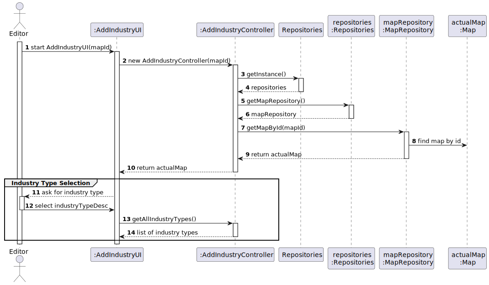
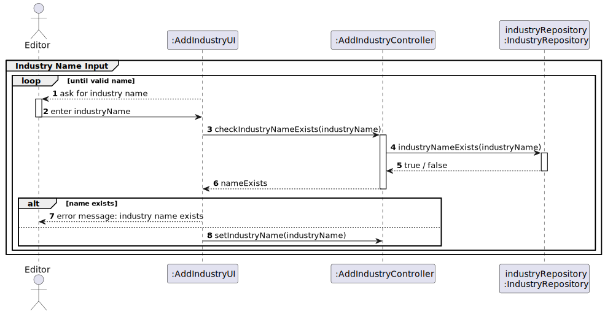
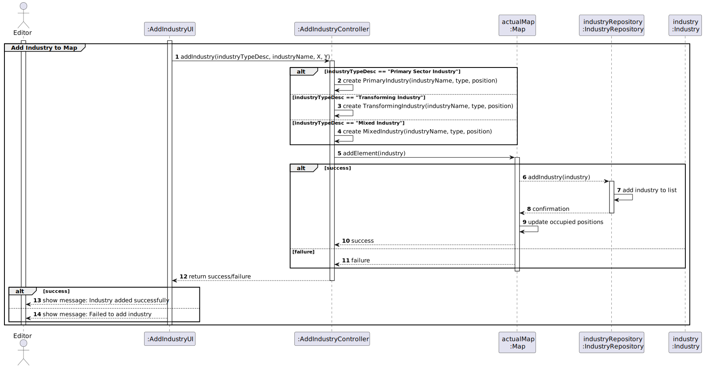
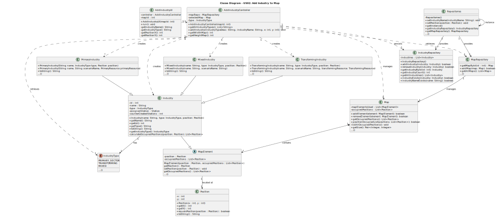

# US02 - Add an Industry

## 3. Design

### 3.1. Rationale

**The rationale grounds on the SSD interactions and the identified input/output data.**

| Interaction ID | Question: Which class is responsible for...        | Answer                 | Justification (with patterns)                                                                                              |
|:---------------|:---------------------------------------------------|:-----------------------|:---------------------------------------------------------------------------------------------------------------------------|
| **Step 1**     | ... interacting with the actor?                    | AddIndustryUI          | Pure Fabrication: there is no reason to assign this responsibility to any existing class in the Domain Model.              |
|                | ... coordinating the US?                           | AddIndustryController  | Controller                                                                                                                 |
|                | ... knowing the current map selection?             | MapRepository          | IE: maintains all available maps.                                                                                          |
| **Step 2**     | ... showing error if no map selected?              | AddIndustryUI          | Pure Fabrication: UI responsibility.                                                                                       |
| **Step 3**     | ... storing the selected map?                      | AddIndustryController  | Controller: coordinates the flow.                                                                                          |
| **Step 4**     | ... knowing all available industry types?          | IndustryTypeRepository | IE: maintains all industry types.                                                                                          |
|                | ... displaying industry types?                     | AddIndustryUI          | Pure Fabrication: UI responsibility.                                                                                       |
| **Step 5**     | ... validating selected industry type?             | IndustryType           | IE: knows its own valid data.                                                                                              |
|                | ... storing selected industry type?                | AddIndustryController  | Controller: temporary storage before submission.                                                                           |
| **Step 6**     | ... validating position bounds?                    | Map                    | IE: knows its own dimensions/bounds.                                                                                       |
|                | ... checking position availability?                | Map                    | IE: knows which positions are occupied.                                                                                    |
|                | ... showing position errors?                       | AddIndustryUI          | Pure Fabrication: UI responsibility.                                                                                       |
| **Step 7**     | ... instantiating a new Industry?                  | Map                    | Creator: in the DM Map contains Industries.                                                                                |
|                | ... adding industry to map?                        | Map                    | IE: owns/manages its industries.                                                                                           |
| **Step 8**     | ... informing operation success?                   | AddIndustryUI          | Pure Fabrication: UI responsibility.                                                                                       |

### Systematization ##

According to the taken rationale, the conceptual classes promoted to software classes are:

* Editor
* Map
* Position
* Industry
* IndustryType

Other software classes (i.e. Pure Fabrication) identified:

* AddIndustryUI  
* AddIndustryController
* MapRepository
* IndustryRepository
* IndustryTypeRepository

## 3.2. Sequence Diagram (SD)

**US02 Sequence Diagram - Full**

**US02 Sequence Diagram - Partial - Select Industry Type**

**US02 Sequence Diagram - Partial - Industry Name Input**

**US02 Sequence Diagram - Partial - Industry Position Input**

**US02 Sequence Diagram - Partial - Add Industry to Map**

## 3.3. Class Diagram (CD)

