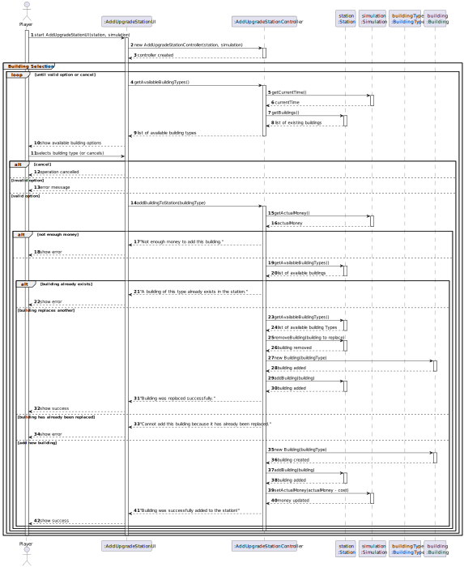
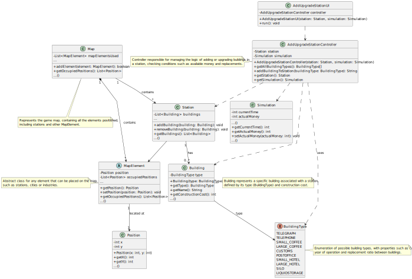

# # US06 - Upgrade a station with a building

## 3. Design

### 3.1. Rationale

**The rationale grounds on the SSD interactions and the identified input/output data.**

| Interaction ID | Question: Which class is responsible for... | Answer                      | Justification (with patterns)                                           |
|:-------------  |:--------------------------------------------|:----------------------------|:------------------------------------------------------------------------|
| Step 1  		 | 	... interacting with the actor?            | AddUpgradeStationUI         | Pure Fabrication: UI class responsible for interaction with player.     |
|                | ... coordinating the US?                    | AddUpgradeStationController | Controller: Coordinates the logic of building upgrade.                  |
| Step 2  		 | ... prompting the user for station?         | AddUpgradeStationUI         | IE: Interface handles interaction.                                      |
|                | ... validating station selection?           | AddUpgradeStationController | Controller: Responsible for station logic.                              |
| Step 3  		 | 	... listing available buildings?           | AddUpgradeStationController | IE: Has access to station state and building definitions.               |
| Step 4  		 | ... handling user selection?                | 	AddUpgradeStationUI        | IE: UI captures player’s selection.                                     |
| Step 5  		 | 	... validating upgrade requirements?       | AddUpgradeStationController | IE: Validates based on station state and simulation context.            |
| Step 6  		 | 	... getting current time and money?        | Simulation	                 | IE: Holds game’s temporal and financial state.                          |              
| Step 7  		 | ... checking existing buildings?            | Station                     | IE: Knows its current list of buildings.                                |
| Step 8  		 | 	... removing building (if replaced)?       | Station                     | 	IE: Responsible for maintaining consistency of its building list.      |
| Step 9  		 | ... instantiating new building?             | Building                    | Creator: Created based on selected BuildingType.                        |
|                | ... adding building to the station?         | Station                     | 	IE: Encapsulates its own building list logic.                          |
| Step 10  		 | ... updating the player’s money?            | Simulation                  | 	IE: Responsible for managing the game economy.                         |  
|                | ... returning feedback to the player?       | AddUpgradeStationUI         | IE: Responsible for presenting success/failure messages to the player.  |

### Systematization ##

According to the taken rationale, the conceptual classes promoted to software classes are:

* Station
* Building
* Simulation
* BuildingType

Other software classes (Pure Fabrication):

* AddUpgradeStationUI
* AddUpgradeStationController

## 3.2. Sequence Diagram (SD)

This diagram shows the complete sequence of interactions that allow the user to upgrade a station with a building.

## 3.3. Class Diagram (CD)

The class diagram presents the software classes and their main relations, attributes, and responsibilities involved in fulfilling the user story.

