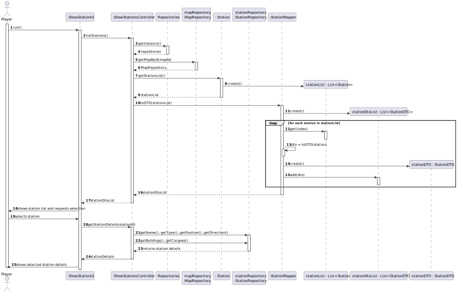
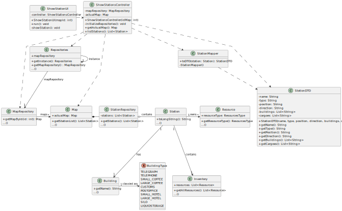

# US07 - View station details

## 3. Design

### 3.1. Rationale

**The rationale grounds on the SSD interactions and the identified input/output data.**

| Interaction ID | Question: Which class is responsible for...                       | Answer  | Justification (with patterns)  |
|:-------------  |:------------------------------------------------------------------|:------------|:---------------------------- |
| Step 1  		 | 				Initiating the request to view the stations?			               |    ShowStationUI         |               It represents the UI layer and is triggered by the player (Controller pattern).               |
| Step 2  		 | 				Delegating the station listing operation?			                  |      ShowStationsController       |              Controller handles business logic and mediates between UI and domain (Controller pattern).                |
| Step 3  		 | 					Providing centralized access to repositories?			             |      Repositories       |               Singleton that encapsulates repository access (Pure Fabrication + Singleton pattern).               |
| Step 4  		 | 				Retrieving the MapRepository instance?			                     |       Repositories      |             Acts as a repository/service locator (Pure Fabrication).                 |
| Step 5  		 | 			Retrieving the Map by its ID?				                              |       MapRepository      |               Repository pattern, isolates access to persistent map data.               |
| Step 6  		 | 			Returning the list of stations on the selected map?					       |      Map       |               Holds and manages station data (Information Expert).               |              
| Step 7  		 | 					Providing the list of stations stored in the system?			      |      StationRepository       |                	Repository for Station entities (Repository pattern).              |
| Step 8  		 | 					Returning the station list to UI for user selection?			      |      ShowStationsController       |               Controller acts as a mediator, returning data to UI.               |
| Step 9  		 | 				Accessing selected station’s identity and basic data?			      |      Station       |              Encapsulates name, position, type, direction (Information Expert).                |
| Step 10  		 | 					Retrieving buildings associated with a station?			           |     Station → Building        |                	Each Station owns Building; Building provides name/type (Expert).              |  
| Step 11  		 | 				Retrieving inventory object from station?			                  |       Station      |                 	Aggregates Inventory; delegates resource data access (Expert).             |
| Step 12  		 | 					Retrieving list of resources from inventory?			              |       Inventory      |              	Aggregates Resource list (Information Expert).                |
| Step 13  		 | 					Retrieving resource type and quantity from each resource?			 |      Resource       |              	Owns resource data and exposes it (Expert).                |

### Systematization ##

According to the taken rationale, the conceptual classes promoted to software classes are:

* Map
* Station
* Inventory
* Resource
* Building

Other software classes (i.e. Pure Fabrication) identified:

* ShowStationUI
* ShowStationsController
* Repositories
* MapRepository
* StationRepository

## 3.2. Sequence Diagram (SD)

## 3.3. Class Diagram (CD)

