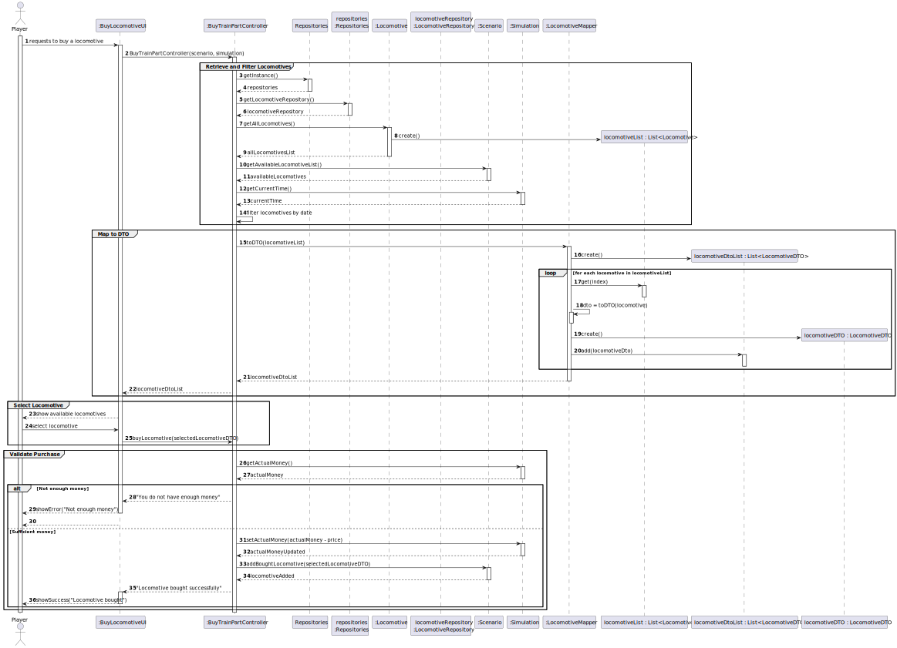
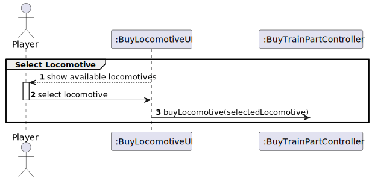
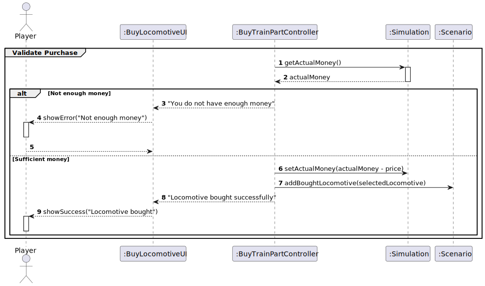
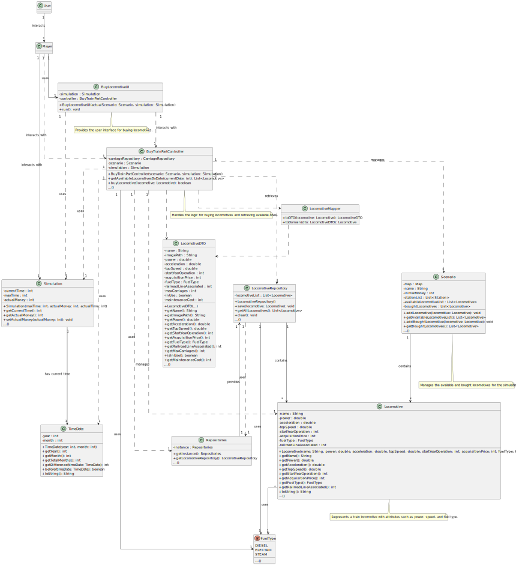

# US09 - Buy a Locomotive

## 3. Design

### 3.1. Rationale

**The rationale grounds on the SSD interactions and the identified input/output data.**

| Interaction ID | Question: Which class is responsible for...         | Answer                 | Justification (with patterns)                                                                                                       |
|:---------------|:---------------------------------------------------|:-----------------------|:------------------------------------------------------------------------------------------------------------------------------------|
| **Step 1**     | ... interacting with the actor?                    | BuyLocomotiveUI        | Pure Fabrication: there is no reason to assign this responsibility to any existing class in the Domain Model.                       |
|                | ... coordinating the US?                           | BuyTrainPartController | Controller                                                                                                                          |
| **Step 2**     | ... retrieving all available locomotives?          | LocomotiveRepository   | IE: maintains all available locomotives.                                                                                           |
| **Step 3**     | ... filtering locomotives by date?                 | BuyTrainPartController | Controller: coordinates the filtering logic.                                                                                        |
| **Step 4**     | ... displaying the available locomotives?          | BuyLocomotiveUI        | Pure Fabrication: UI responsibility.                                                                                               |
| **Step 5**     | ... validating if there is enough money?           | Simulation             | IE: knows the current available money.                                                                                             |
| **Step 6**     | ... updating the money after the purchase?         | Simulation             | IE: manages the state of the money.                                                                                                |
| **Step 7**     | ... adding the purchased locomotive to the scenario? | Scenario              | IE: manages the purchased locomotives.                                                                                             |
| **Step 8**     | ... informing the success or failure of the operation? | BuyLocomotiveUI      | Pure Fabrication: UI responsibility.                                                                                               |

### Systematization ##

According to the taken rationale, the conceptual classes promoted to software classes are:

* Player
* Locomotive
* Scenario
* Simulation

Other software classes (i.e. Pure Fabrication) identified:

* BuyLocomotiveUI  
* BuyTrainPartController
* LocomotiveRepository
* Repositories

## 3.2. Sequence Diagram (SD)

**US09 Sequence Diagram - Full**

**US09 Sequence Diagram - Partial - Retrieve Available Locomotives**

**US02 Sequence Diagram - Partial - Industry Name Input**

**US02 Sequence Diagram - Partial - Industry Position Input**

## 3.3. Class Diagram (CD)

