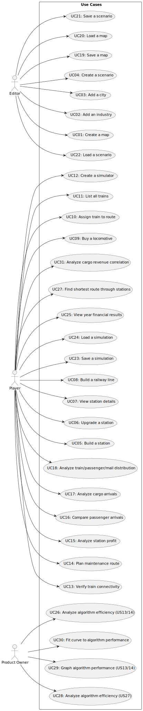

# Use Case Diagram (UCD)

**In the scope of this project, there is a direct relationship of _1 to 1_ between Use Cases (UC) and User Stories (US).**

# Use Cases / User Stories
| UC/US | Description                                                            |                   
|:------|:-----------------------------------------------------------------------|
| US01  | [Create a map](../../US01/US01-README.md)                              |
| US02  | [Add an industry](../../US02/US02-README.md)                           |
| US03  | [Add a city](../../US03/US03-README.md)                                |
| US04  | [Create a scenario](../../US04/US04-README.md)                         |
| US05  | [Build a station](../../US05/US05-README.md)                           |
| US06  | [Upgrade a station](../../US06/US06-README.md)                         |
| US07  | [View station details](../../US07/US07-README.md)                      |
| US08  | [Build a railway line](../../US08/US08-README.md)                      |
| US09  | [Buy a locomotive](../../US09/US09-README.md)                          |
| US10  | [Assign Train to Route](../../US10/US10-README.md)                     |
| US11  | [List all trains](../../US11/US11-README.md)                           |
| US12  | [Create a simulator](../../US12/US12-README.md)                        |
| US13  | [Verify train connectivity](../../US13/US13-README.md)                 |
| US14  | [Plan maintenance route](../../US14/US14-README.md)                    |
| US15  | [Analyze station profit](../../US15/US15-README.md)                    |
| US16  | [Compare passenger arrivals](../../US16/US16-README.md)                |
| US17  | [Analyze cargo arrivals](../../US17/US17-README.md)                    |
| US18  | [Analyze train/passenger/mail distribution](../../US18/US18-README.md) |
| US19  | [Save a map](../../US19/US19-README.md)                                |
| US20  | [Load a map](../../US20/US20-README.md)                                |
| US21  | [Save a scenario](../../US21/US21-README.md)                           |
| US22  | [Load a scenario](../../US22/US22-README.md)                           |
| US23  | [Save a simulation](../../US23/US23-README.md)                         |
| US24  | [Load a simulation](../../US24/US24-README.md)                         |
| US25  | [View year financial results](../../US25/US25-README.md)               |
| US26  | [Analyze algorithm efficiency (US13/14)](../../US26/US26-README.md)    |
| US27  | [Find shortest route through stations](../../US27/US27-README.md)      |
| US28  | [Analyze algorithm efficiency (US27)](../../US28/US28-README.md)       |
| US29  | [Graph algorithm performance (US13/14)](../../US29/US29-README.md)     |
| US30  | [Fit curve to algorithm performance](../../US30/US30-README.md)        |
| US31  | [Analyze cargo revenue correlation](../../US31/US31-README.md)         |
